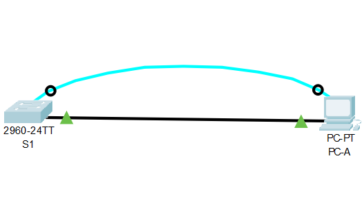

# Схема стенда


# Команды IOS. Базовая конфигурация устройств

## Таблица адресации

| Устройство    | Интерфейс          | IP-адрес / префикс  |
| ------------- |:------------------:| ------------------: |
| S1            | VLAN1              |  192.168.1.2/24     |
| PC-A          | NIC                |  192.168.1.10/24    |

## Часть 1. Создание сети и проверка настроек коммутатора по умолчанию

### Шаг 1. Создайте сеть согласно топологии.
Добавлены устройства `S1` и `PC-A`.
Соединены кабелем через порты `Console` и `RS 232` соответственно.

> Почему нужно использовать консольное подключение для первоначальной настройки коммутатора?

Другие интерфейсы при начальном старте устройства по умолчанию отключены, требуется подключение к физическому порту

> Почему нельзя подключиться к коммутатору через Telnet или SSH?

По той же причине - сетевые интерфейсы устройства не сконфигурированы

```shell
Switch>enable
Switch#show running-config 
Building configuration...

Current configuration : 1080 bytes
!
version 15.0
no service timestamps log datetime msec
no service timestamps debug datetime msec
no service password-encryption
!
hostname Switch
!
!
!
!
!
!
spanning-tree mode pvst
spanning-tree extend system-id
!
interface FastEthernet0/1
!
interface FastEthernet0/2
!
interface FastEthernet0/3
!
interface FastEthernet0/4
!
interface FastEthernet0/5
!
interface FastEthernet0/6
!
interface FastEthernet0/7
!
interface FastEthernet0/8
!
interface FastEthernet0/9
!
interface FastEthernet0/10
!
interface FastEthernet0/11
!
interface FastEthernet0/12
!
interface FastEthernet0/13
!
interface FastEthernet0/14
!
interface FastEthernet0/15
!
interface FastEthernet0/16
!
interface FastEthernet0/17
!
interface FastEthernet0/18
!
interface FastEthernet0/19
!
interface FastEthernet0/20
!
interface FastEthernet0/21
!
interface FastEthernet0/22
!
interface FastEthernet0/23
!
interface FastEthernet0/24
!
interface GigabitEthernet0/1
!
interface GigabitEthernet0/2
!
interface Vlan1
 no ip address
 shutdown
!
!
!
!
line con 0
!
line vty 0 4
 login
line vty 5 15
 login
!
!
!
!
end
```

### Шаг 2. Проверьте настройки коммутатора по умолчанию.

Устройство имеет конфигурацию по умолчанию

> Сколько интерфейсов FastEthernet имеется на коммутаторе 2960?

24

> Сколько интерфейсов Gigabit Ethernet имеется на коммутаторе 2960?

2

> Каков диапазон значений, отображаемых в vty-линиях?

```shell
line vty 0 4
line vty 5 15
```

> Изучите файл загрузочной конфигурации (startup configuration), который содержится в энергонезависимом ОЗУ (NVRAM).
> Почему появляется это сообщение?

```shell
Switch#show startup-config
startup-config is not present
```

Сообщение появляется по причине отсутствия сохраненной конфигурации

> Изучите характеристики SVI для VLAN 1.

> Назначен ли IP-адрес сети VLAN 1?

нет

```shell
Switch#show ip interface Vlan 1
Vlan1 is administratively down, line protocol is down
  Internet protocol processing disabled
```

> Какой MAC-адрес имеет SVI? Возможны различные варианты ответов.

`0090.0c4c.4163`

```shell
Switch>show interface Vlan1
Vlan1 is administratively down, line protocol is down
  Hardware is CPU Interface, address is 0090.0c4c.4163 (bia 0090.0c4c.4163)
  MTU 1500 bytes, BW 100000 Kbit, DLY 1000000 usec,
     reliability 255/255, txload 1/255, rxload 1/255
  Encapsulation ARPA, loopback not set
  ARP type: ARPA, ARP Timeout 04:00:00
  Last input 21:40:21, output never, output hang never
  Last clearing of "show interface" counters never
  Input queue: 0/75/0/0 (size/max/drops/flushes); Total output drops: 0
  Queueing strategy: fifo
  Output queue: 0/40 (size/max)
  5 minute input rate 0 bits/sec, 0 packets/sec
  5 minute output rate 0 bits/sec, 0 packets/sec
     1682 packets input, 530955 bytes, 0 no buffer
     Received 0 broadcasts (0 IP multicast)
     0 runts, 0 giants, 0 throttles
     0 input errors, 0 CRC, 0 frame, 0 overrun, 0 ignored
     563859 packets output, 0 bytes, 0 underruns
     0 output errors, 23 interface resets
     0 output buffer failures, 0 output buffers swapped out
```

> Данный интерфейс включен?

Нет

> Изучите IP-свойства интерфейса SVI сети VLAN 1.
> Какие выходные данные вы видите?

```shell
Switch#show ip interface Vlan 1
Vlan1 is administratively down, line protocol is down
  Internet protocol processing disabled
```

> Подсоедините кабель Ethernet компьютера PC-A к порту 6 на коммутаторе и изучите IP-свойства интерфейса SVI сети VLAN 1. Дождитесь согласования параметров скорости и дуплекса между коммутатором и ПК.
> Какие выходные данные вы видите?

В консоли:

```shell
%LINK-5-CHANGED: Interface FastEthernet0/6, changed state to up
%LINEPROTO-5-UPDOWN: Line protocol on Interface FastEthernet0/6, changed state to up
```

но интерфейс по-прежнему выключен

> Изучите сведения о версии ОС Cisco IOS на коммутаторе.
> Под управлением какой версии ОС Cisco IOS работает коммутатор?

```shell
Switch>show version
Cisco IOS Software, C2960 Software (C2960-LANBASEK9-M), Version 15.0(2)SE4, RELEASE SOFTWARE (fc1)
...
```

> Как называется файл образа системы?

`C2960-LANBASEK9-M`

> Какой базовый MAC-адрес назначен коммутатору?

`Base ethernet MAC Address       : 00:17:59:A7:51:80`

> Изучите свойства по умолчанию интерфейса FastEthernet, который используется компьютером PC-A.
> Switch# show interface f0/6
> Интерфейс включен или выключен?

выключен

> Что нужно сделать, чтобы включить интерфейс?

```shell
Switch#configure terminal 
Enter configuration commands, one per line.  End with CNTL/Z.
Switch(config)#interface f0/6
Switch(config-if)#no shutdown 

%LINK-5-CHANGED: Interface FastEthernet0/6, changed state to up

%LINEPROTO-5-UPDOWN: Line protocol on Interface FastEthernet0/6, changed state to up
```

> Какой MAC-адрес у интерфейса?

```shell
Switch>sh interfaces f0/6
FastEthernet0/6 is up, line protocol is up (connected)
  Hardware is Lance, address is 0030.a351.5906 (bia 0030.a351.5906)
...
```

> Какие настройки скорости и дуплекса заданы в интерфейсе?

```shell
Full-duplex, 100Mb/s
```

> Изучите параметры сети VLAN по умолчанию на коммутаторе.
> Какое имя присвоено сети VLAN 1 по умолчанию?
> Какие порты расположены в сети VLAN 1?
> Активна ли сеть VLAN 1?
> К какому типу сетей VLAN принадлежит VLAN по умолчанию?

Не совсем понятно, что ответить, так как интерфейс выключен

```shell
Switch#show interfaces Vlan1
Vlan1 is administratively down, line protocol is down
  Hardware is CPU Interface, address is 0090.0c4c.4163 (bia 0090.0c4c.4163)
  MTU 1500 bytes, BW 100000 Kbit, DLY 1000000 usec,
     reliability 255/255, txload 1/255, rxload 1/255
  Encapsulation ARPA, loopback not set
  ARP type: ARPA, ARP Timeout 04:00:00
  Last input 21:40:21, output never, output hang never
  Last clearing of "show interface" counters never
  Input queue: 0/75/0/0 (size/max/drops/flushes); Total output drops: 0
  Queueing strategy: fifo
  Output queue: 0/40 (size/max)
  5 minute input rate 0 bits/sec, 0 packets/sec
  5 minute output rate 0 bits/sec, 0 packets/sec
     1682 packets input, 530955 bytes, 0 no buffer
     Received 0 broadcasts (0 IP multicast)
     0 runts, 0 giants, 0 throttles
     0 input errors, 0 CRC, 0 frame, 0 overrun, 0 ignored
     563859 packets output, 0 bytes, 0 underruns
     0 output errors, 23 interface resets
     0 output buffer failures, 0 output buffers swapped out
```

> Изучите флеш-память.
> Какое имя присвоено образу Cisco IOS?

```shell
2960-lanbasek9-mz.150-2.SE4.bin
```

## Часть 2. Настройка базовых параметров сетевых устройств

### Шаг 1. Настройте базовые параметры коммутатора

> Для чего нужна команда login?

включает авторизацию по заданному паролю

### Шаг 2. Настройте IP-адрес на компьютере PC-A.

проведена настройка ip-адреса

## Часть 3. Проверка сетевых подключений

### Шаг 1

> Проверьте параметры VLAN 1.
> S1# show interface vlan 1
> Какова полоса пропускания этого интерфейса?

`BW 100000 Kbit`

> В каком состоянии находится VLAN 1?

`Vlan1 is up`

> В каком состоянии находится канальный протокол?

под канальным протоколом подразумевается видимо вот это?
`line protocol is up`

### Шаг 2

S1 -> PC-A

```shell
S1# ping 192.168.1.10

Type escape sequence to abort.
Sending 5, 100-byte ICMP Echos to 192.168.1.10, timeout is 2 seconds:
.!!!!
Success rate is 80 percent (4/5), round-trip min/avg/max = 0/0/0 ms
```

PC-A -> S1

```shell
C:\>ping 192.168.1.2

Pinging 192.168.1.2 with 32 bytes of data:

Reply from 192.168.1.2: bytes=32 time<1ms TTL=255
Reply from 192.168.1.2: bytes=32 time<1ms TTL=255
Reply from 192.168.1.2: bytes=32 time<1ms TTL=255
Reply from 192.168.1.2: bytes=32 time<1ms TTL=255

Ping statistics for 192.168.1.2:
    Packets: Sent = 4, Received = 4, Lost = 0 (0% loss),
Approximate round trip times in milli-seconds:
    Minimum = 0ms, Maximum = 0ms, Average = 0ms
```

### Шаг 3

Проверка подключения к `S1` посредством telnet

```shell
C:\>telnet 192.168.1.2
Trying 192.168.1.2 ...Open

Unauthorized access is strictly prohibited. 


User Access Verification

Password: 
S1>show version
Cisco IOS Software, C2960 Software (C2960-LANBASEK9-M), Version 15.0(2)SE4, RELEASE SOFTWARE (fc1)
...
```

> Зачем необходимо настраивать пароль VTY для коммутатора?

Чтобы иметь возможность подключиться удаленно

> Что нужно сделать, чтобы пароли не отправлялись в незашифрованном виде?

Включить шифрование пароля выполнив команду `service password-encryption`
