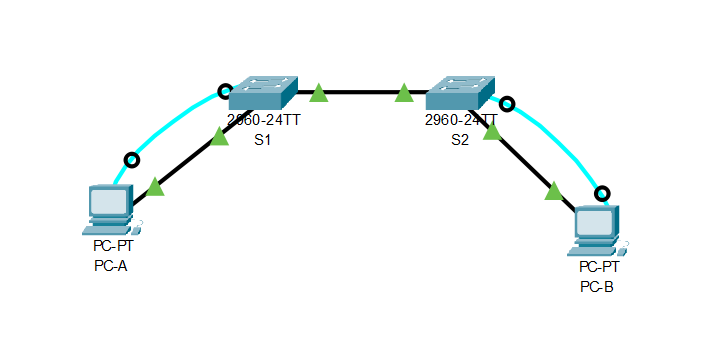

# Схема стенда


## Таблица адресации

| Устройство    | Интерфейс   | IP-адрес      | Маска подсети |
| :------------ |:----------- | :------------ | :------------ |
| S1            | VLAN 1      | 192.168.1.11  | 255.255.255.0 |
| S2            | VLAN 1      | 192.168.1.12  | 255.255.255.0 |
| PC-A          | NIC         | 192.168.1.1   | 255.255.255.0 |
| PC-B          | NIC         | 192.168.1.2   | 255.255.255.0 |

# Канальный уровень. Ethernet

## Часть 1. Создание и настройка сети

> Подключите сеть в соответствии с топологией.
> Настройте узлы ПК.
> Выполните инициализацию и перезагрузку коммутаторов.
> Настройте базовые параметры каждого коммутатора.

Выполнено.

>  1. Настройте имена устройств в соответствии с топологией.

```shell
Switch>enable
Switch#configure terminal
Switch(config)#hostname S1
S1(config)#
```

```shell
Switch>enable
Switch#configure terminal
Switch(config)#hostname S2
S2(config)#
```

>  2. Настройте IP-адреса, как указано в таблице адресации.

```shell
S1(config)#interface Vlan 1
S1(config-if)#ip address 192.168.1.11 255.255.255.0
S1(config-if)#no shutdown
%LINK-5-CHANGED: Interface Vlan1, changed state to up

%LINEPROTO-5-UPDOWN: Line protocol on Interface Vlan1, changed state to up
```

```shell
S2#configure terminal 
S2(config)#interface Vlan 1
S2(config-if)#ip address 192.168.1.12 255.255.255.0
S2(config-if)#no shutdown 
%LINK-5-CHANGED: Interface Vlan1, changed state to up

%LINEPROTO-5-UPDOWN: Line protocol on Interface Vlan1, changed state to up
```

>  3. Назначьте cisco в качестве паролей консоли и VTY.
>  4. Назначьте class в качестве пароля доступа к привилегированному режиму EXEC.

```shell
S1>enable
S1#configure terminal
S1(config)#line console 0
S1(config-line)#password cisco
S1(config-line)#login
S1(config)#enable secret class
S1(config)#line vty 0 15
S1(config-line)#password cisco
S1(config-line)#login
S1(config)#service password-encryption 
S1(config)#exit
```

```shell
S2>enable
S2#configure terminal
S2(config)#line console 0
S2(config-line)#password cisco
S2(config-line)#login
S2(config)#enable secret class
S2(config)#line vty 0 15
S2(config-line)#password cisco
S2(config-line)#login
S2(config)#service password-encryption 
S2(config)#exit
```
