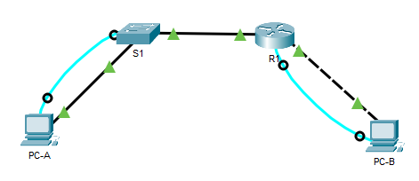

# Оглавление
* [Схема стенда](#scheme)
* [Таблица адресации](#table)
* [Часть 1. Настройка топологии и конфигурация основных параметров маршрутизатора и коммутатора](#part1)
* [Часть 2. Ручная настройка IPv6-адресов](#part2)
* [Часть 3. Проверка сквозного соединения](#part3)
* [Вопросы для повторения](#questions)

# <a name="scheme"></a>Схема стенда


# <a name="table"></a>Таблица адресации

| Устройство    | Интерфейс          | IPv6-адрес            | Длина префикса | Шлюз по умолчанию |
| ------------- |:------------------:| :-------------------: | :------------- | :---------------- |
| R1            | G0/0/0             |  `2001:db8:acad:a::1` | 64             | -                 |
|               | G0/0/1             |  `2001:db8:acad:1::1` | 64             | -                 |
| S1            | VLAN 1             |  `2001:db8:acad:1::b` | 64             | -                 |
| PC-A          | NIC                |  `2001:db8:acad:1::3` | 64             | fe80::1           |
| PC-B          | NIC                |  `2001:db8:acad:a::3` | 64             | fe80::1           |

# <a name="part1"></a>Часть 1. Настройка топологии и конфигурация основных параметров маршрутизатора и коммутатора

Установка шаблона dual-ipv4-and-ipv6

```shell
Switch>en
Switch#show sdm prefer
 The current template is "default" template.
 The selected template optimizes the resources in
 the switch to support this level of features for
 0 routed interfaces and 1024 VLANs.

  number of unicast mac addresses:                  8K
  number of IPv4 IGMP groups + multicast routes:    0.25K
  number of IPv4 unicast routes:                    0
  number of IPv6 multicast groups:                  0
  number of directly-connected IPv6 addresses:      0
  number of indirect IPv6 unicast routes:           0
  number of IPv4 policy based routing aces:         0
  number of IPv4/MAC qos aces:                      0.125k
  number of IPv4/MAC security aces:                 0.375k
  number of IPv6 policy based routing aces:         0
  number of IPv6 qos aces:                          20
  number of IPv6 security aces:                     25

Switch#configure terminal
Enter configuration commands, one per line.  End with CNTL/Z.
Switch(config)#sdm prefer dual-ipv4-and-ipv6 default 
Changes to the running SDM preferences have been stored, but cannot take effect until the next reload.
Use 'show sdm prefer' to see what SDM preference is currently active.
Switch(config)#end
Switch(config)>reload
```

# <a name="part2"></a>Часть 2. Ручная настройка IPv6-адресов
## Назначьте IPv6-адреса интерфейсам Ethernet на R1

> Назначьте глобальные индивидуальные IPv6-адреса, указанные в таблице адресации обоим интерфейсам Ethernet на R1.

```shell
R1(config)#interface G0/0/0
R1(config-if)#ipv6 address 2001:db8:acad:a::1/64
R1(config-if)#no sh

R1(config-if)#interface G0/0/1
R1(config-if)#ipv6 address 2001:db8:acad:1::1/64
R1(config-if)#no sh

```

> Введите команду show ipv6 interface brief, чтобы проверить, назначен ли каждому интерфейсу корректный индивидуальный IPv6-адрес.

```shell
R1#sh ipv6 interface brief 
GigabitEthernet0/0/0       [up/up]
    FE80::20B:BEFF:FE53:2001
    2001:DB8:ACAD:A::1
GigabitEthernet0/0/1       [up/up]
    FE80::20B:BEFF:FE53:2002
    2001:DB8:ACAD:1::1
Vlan1                      [administratively down/down]
    unassigned
```

> Чтобы обеспечить соответствие локальных адресов канала индивидуальному адресу, вручную введите локальные адреса канала на каждом интерфейсе Ethernet на R1.

```shell
R1(config)#interface G0/0/0
R1(config-if)#ipv6 address fe80::1 link-local

R1(config)#interface G0/0/1
R1(config-if)#ipv6 address fe80::1 link-local
```

> Используйте выбранную команду, чтобы убедиться, что локальный адрес связи изменен на fe80::1.

```shell
R1#sh ipv6 int br
GigabitEthernet0/0/0       [up/up]
    FE80::205:5EFF:FE62:D101
    2001:DB8:ACAD:A::1
GigabitEthernet0/0/1       [up/up]
    FE80::205:5EFF:FE62:D102
    2001:DB8:ACAD:1::1
Vlan1                      [administratively down/down]
```

> Какие группы многоадресной рассылки назначены интерфейсу G0/0?

* FF02::1
* FF02::1:FF00:1

```shell
R1#sh ipv6 interface g0/0
%Invalid interface type and number
R1#sh ipv6 interface g0/0/0
GigabitEthernet0/0/0 is up, line protocol is up
  IPv6 is enabled, link-local address is FE80::1
  No Virtual link-local address(es):
  Global unicast address(es):
    2001:DB8:ACAD:A::1, subnet is 2001:DB8:ACAD:A::/64
  Joined group address(es):
    FF02::1
    FF02::1:FF00:1
  MTU is 1500 bytes
  ICMP error messages limited to one every 100 milliseconds
  ICMP redirects are enabled
  ICMP unreachables are sent
  ND DAD is enabled, number of DAD attempts: 1
  ND reachable time is 30000 milliseconds
```

## Активируйте IPv6-маршрутизацию на R1.

> В командной строке на PC-B введите команду ipconfig, чтобы получить данные IPv6-адреса, назначенного интерфейсу ПК.
Вопрос:
Назначен ли индивидуальный IPv6-адрес сетевой интерфейсной карте (NIC) на PC-B?

Нет, только LLA.

```shell
C:\>ipconfig

FastEthernet0 Connection:(default port)

   Connection-specific DNS Suffix..: 
   Link-local IPv6 Address.........: FE80::203:E4FF:FEA0:1128
   IPv6 Address....................: ::
   IPv4 Address....................: 0.0.0.0
   Subnet Mask.....................: 0.0.0.0
   Default Gateway.................: ::
                                     0.0.0.0
```

> Активируйте IPv6-маршрутизацию на R1 с помощью команды IPv6 unicast-routing,
  чтобы убедиться, что новая многоадресная группа назначена интерфейсу G0/0/0. Обратите внимание, что в списке групп для интерфейса G0/0 отображается группа многоадресной рассылки всех маршрутизаторов (FF02::2).

```shell
R1#show ipv6 interface G0/0/0
GigabitEthernet0/0/0 is up, line protocol is up
  IPv6 is enabled, link-local address is FE80::1
  No Virtual link-local address(es):
  Global unicast address(es):
    2001:DB8:ACAD:A::1, subnet is 2001:DB8:ACAD:A::/64
  Joined group address(es):
    FF02::1
    FF02::2
    FF02::1:FF00:1
  MTU is 1500 bytes
  ICMP error messages limited to one every 100 milliseconds
  ICMP redirects are enabled
  ICMP unreachables are sent
  ND DAD is enabled, number of DAD attempts: 1
  ND reachable time is 30000 milliseconds
  ND advertised reachable time is 0 (unspecified)
  ND advertised retransmit interval is 0 (unspecified)
  ND router advertisements are sent every 200 seconds
  ND router advertisements live for 1800 seconds
  ND advertised default router preference is Medium
  Hosts use stateless autoconfig for addresses.
```

> Теперь, когда R1 входит в группу многоадресной рассылки всех маршрутизаторов, еще раз введите команду ipconfig на PC-B. Проверьте данные IPv6-адреса.

Также включил автоматический режим для ipv6 на PC-A и PC-B, в ином случае адреса от роутера не назначаются.

```shell
C:\>ipconfig

FastEthernet0 Connection:(default port)

   Connection-specific DNS Suffix..: 
   Link-local IPv6 Address.........: FE80::203:E4FF:FEA0:1128
   IPv6 Address....................: 2001:DB8:ACAD:A:203:E4FF:FEA0:1128
   IPv4 Address....................: 0.0.0.0
   Subnet Mask.....................: 0.0.0.0
   Default Gateway.................: FE80::1
                                     0.0.0.0
```

> Почему PC-B получил глобальный префикс маршрутизации и идентификатор подсети, которые вы настроили на R1?

PC-B получил этот адрес и идентификатор сети от R1 так как он теперь входит в группу многоадресной рассылки маршрутизаторов FF02::2

## Назначьте IPv6-адреса интерфейсу управления (SVI) на S1.
> Назначьте адрес IPv6 для S1. Также назначьте этому интерфейсу локальный адрес канала.

```shell
S1>en
S1#conf t
Enter configuration commands, one per line.  End with CNTL/Z.
S1(config)#int vlan 1
S1(config-if)#ipv6 address 2001:db8:acad:1::b/64
S1(config-if)#no sh

S1(config-if)#
%LINK-5-CHANGED: Interface Vlan1, changed state to up

%LINEPROTO-5-UPDOWN: Line protocol on Interface Vlan1, changed state to up
S1(config-if)#ipv6 address fe80::2 link-local 
```

> Проверьте правильность назначения IPv6-адресов интерфейсу управления с помощью команды show ipv6 interface vlan1.

```shell
S1#show ipv6 interface vlan 1
Vlan1 is up, line protocol is up
  IPv6 is enabled, link-local address is FE80::2
  No Virtual link-local address(es):
  Global unicast address(es):
    2001:DB8:ACAD:1::B, subnet is 2001:DB8:ACAD:1::/64
  Joined group address(es):
    FF02::1
    FF02::1:FF00:1
    FF02::1:FF00:B
  MTU is 1500 bytes
  ICMP error messages limited to one every 100 milliseconds
  ICMP redirects are enabled
  ICMP unreachables are sent
  Output features: Check hwidb
  ND DAD is enabled, number of DAD attempts: 1
  ND reachable time is 30000 milliseconds
  ND NS retransmit interval is 1000 milliseconds
```

## Назначьте компьютерам статические IPv6-адреса.
> Откройте окно Свойства Ethernet для каждого ПК и назначьте адресацию IPv6.
> Убедитесь, что оба компьютера имеют правильную информацию адреса IPv6. Каждый компьютер должен иметь два глобальных адреса IPv6: один статический и один SLACC

Конфигурация выполнена.

# <a name="part3"></a>Часть 3. Проверка сквозного соединения
> С PC-A отправьте эхо-запрос на FE80::1. Это локальный адрес канала, назначенный G0/1 на R1.

```shell
C:\>ping fe80::1

Pinging fe80::1 with 32 bytes of data:

Reply from FE80::1: bytes=32 time<1ms TTL=255
Reply from FE80::1: bytes=32 time<1ms TTL=255
Reply from FE80::1: bytes=32 time<1ms TTL=255
Reply from FE80::1: bytes=32 time<1ms TTL=255

Ping statistics for FE80::1:
    Packets: Sent = 4, Received = 4, Lost = 0 (0% loss),
Approximate round trip times in milli-seconds:
    Minimum = 0ms, Maximum = 0ms, Average = 0ms
```

> Отправьте эхо-запрос на интерфейс управления S1 с PC-A.

```shell
C:\>ping 2001:DB8:ACAD:1::B

Pinging 2001:DB8:ACAD:1::B with 32 bytes of data:

Reply from 2001:DB8:ACAD:1::B: bytes=32 time<1ms TTL=255
Reply from 2001:DB8:ACAD:1::B: bytes=32 time<1ms TTL=255
Reply from 2001:DB8:ACAD:1::B: bytes=32 time<1ms TTL=255
Reply from 2001:DB8:ACAD:1::B: bytes=32 time<1ms TTL=255

Ping statistics for 2001:DB8:ACAD:1::B:
    Packets: Sent = 4, Received = 4, Lost = 0 (0% loss),
Approximate round trip times in milli-seconds:
    Minimum = 0ms, Maximum = 0ms, Average = 0ms
```

> Введите команду tracert на PC-A, чтобы проверить наличие сквозного подключения к PC-B.

```shell
C:\>ping 2001:db8:acad:a::3

Pinging 2001:db8:acad:a::3 with 32 bytes of data:

Reply from 2001:DB8:ACAD:A::3: bytes=32 time<1ms TTL=127
Reply from 2001:DB8:ACAD:A::3: bytes=32 time<1ms TTL=127
Reply from 2001:DB8:ACAD:A::3: bytes=32 time<1ms TTL=127
Reply from 2001:DB8:ACAD:A::3: bytes=32 time<1ms TTL=127

Ping statistics for 2001:DB8:ACAD:A::3:
    Packets: Sent = 4, Received = 4, Lost = 0 (0% loss),
Approximate round trip times in milli-seconds:
    Minimum = 0ms, Maximum = 0ms, Average = 0ms
```

> С PC-B отправьте эхо-запрос на PC-A.

```shell
C:\>ping 2001:db8:acad:1::3

Pinging 2001:db8:acad:1::3 with 32 bytes of data:

Reply from 2001:DB8:ACAD:1::3: bytes=32 time<1ms TTL=127
Reply from 2001:DB8:ACAD:1::3: bytes=32 time<1ms TTL=127
Reply from 2001:DB8:ACAD:1::3: bytes=32 time<1ms TTL=127
Reply from 2001:DB8:ACAD:1::3: bytes=32 time<1ms TTL=127

Ping statistics for 2001:DB8:ACAD:1::3:
    Packets: Sent = 4, Received = 4, Lost = 0 (0% loss),
Approximate round trip times in milli-seconds:
    Minimum = 0ms, Maximum = 0ms, Average = 0ms
```

> С PC-B отправьте эхо-запрос на локальный адрес канала G0/0 на R1.

```shell
C:\>ping fe80::1

Pinging fe80::1 with 32 bytes of data:

Reply from FE80::1: bytes=32 time=9ms TTL=255
Reply from FE80::1: bytes=32 time<1ms TTL=255
Reply from FE80::1: bytes=32 time<1ms TTL=255
Reply from FE80::1: bytes=32 time<1ms TTL=255

Ping statistics for FE80::1:
    Packets: Sent = 4, Received = 4, Lost = 0 (0% loss),
Approximate round trip times in milli-seconds:
    Minimum = 0ms, Maximum = 9ms, Average = 2ms
```

# <a name="questions"></a>Вопросы для повторения

> Почему обоим интерфейсам Ethernet на R1 можно назначить один и тот же локальный адрес канала — FE80::1?

Потому что LLA действует только в рамках канала

> Какой идентификатор подсети в индивидуальном IPv6-адресе 2001:db8:acad::aaaa:1234/64?

2001:0db8:acad:0000