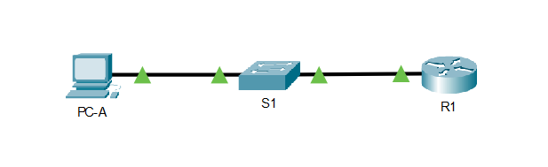

# Оглавление
* [Схема стенда](#scheme)
* [Таблица адресации](#table)
* [Часть 1. Настройка основных параметров устройства](#part1)
* [Часть 2. Настройка маршрутизатора для доступа по протоколу SSH](#part2)
* [Часть 3. Настройка коммутатора для доступа по протоколу SSH](#part3)
* [Часть 4. SSH через интерфейс командной строки (CLI) коммутатора](#part4)

# <a name="scheme"></a>Схема стенда


# <a name="table"></a>Таблица адресации

| Устройство    | Интерфейс          | IP-адрес              | Маска подсети  | Шлюз по умолчанию |
| ------------- |:------------------:| :-------------------: | :------------- | :---------------- |
| R1            | G0/0/1             |  192.168.1.1          | 255.255.255.0  | -                 |
| S1            | VLAN 1             |  192.168.1.11         | 255.255.255.0  | 192.168.1.1       |
| PC-A          | NIC                |  192.168.1.3          | 255.255.255.0  | 192.168.1.1       |

# <a name="part1"></a>Часть 1. Настройка основных параметров устройства

## Настройте маршрутизатор.

> * Подключитесь к маршрутизатору с помощью консоли и активируйте привилегированный режим EXEC.
> * Войдите в режим конфигурации.
> * Отключите поиск DNS, чтобы предотвратить попытки маршрутизатора неверно преобразовывать введенные команды таким образом, как будто они являются именами узлов.
> * Назначьте class в качестве зашифрованного пароля привилегированного режима EXEC.
> * Назначьте cisco в качестве пароля консоли и включите вход в систему по паролю.
> * Назначьте cisco в качестве пароля VTY и включите вход в систему по паролю.
> * Зашифруйте открытые пароли.
> * Создайте баннер, который предупреждает о запрете несанкционированного доступа.
> * Настройте и активируйте на маршрутизаторе интерфейс G0/0/1, используя информацию, приведенную в таблице адресации.
> * Сохраните текущую конфигурацию в файл загрузочной конфигурации.

```shell
R1>enable
R1#conf t
R1(config)#no ip domain-lookup

R1(config)#enable secret class

R1(config)#line vty 0 15
R1(config-line)#password cisco
R1(config-line)#login
R1(config-line)#exit

R1(config)#line console 0
R1(config-line)#password cisco
R1(config-line)#login
R1(config-line)#exit

R1(config)#service password-encryption

R1(config)#banner motd @restricted area!@

R1(config)#interface G0/0/1
R1(config-if)#ip address 192.168.1.1 255.255.255.0
R1(config-if)#no sh
R1(config-if)#end

R1#copy running-config startup-config 
Destination filename [startup-config]? 
Building configuration...
[OK]
```

## Настройте компьютер PC-A.
> * Настройте для PC-A IP-адрес и маску подсети.
> * Настройте для PC-A шлюз по умолчанию.

Выполнено.

## Проверьте подключение к сети.
> Пошлите с PC-A команду Ping на маршрутизатор R1. Если эхо-запрос с помощью команды ping не проходит, найдите и устраните неполадки подключения.

```shell
C:\>ping 192.168.1.1

Pinging 192.168.1.1 with 32 bytes of data:

Reply from 192.168.1.1: bytes=32 time<1ms TTL=255
Reply from 192.168.1.1: bytes=32 time<1ms TTL=255
Reply from 192.168.1.1: bytes=32 time<1ms TTL=255
Reply from 192.168.1.1: bytes=32 time<1ms TTL=255

Ping statistics for 192.168.1.1:
    Packets: Sent = 4, Received = 4, Lost = 0 (0% loss),
Approximate round trip times in milli-seconds:
    Minimum = 0ms, Maximum = 0ms, Average = 0ms
```

# <a name="part2"></a>Часть 2. Настройка маршрутизатора для доступа по протоколу SSH
## Настройте аутентификацию устройств.
> * Задайте имя устройства.
> * Задайте домен для устройства

```shell
R1(config)#ip domain name domain.local
```

## Создайте ключ шифрования с указанием его длины.

```shell
R1(config)#crypto key generate rsa general-keys modulus 2048
The name for the keys will be: R1.domain.local

% The key modulus size is 2048 bits
% Generating 2048 bit RSA keys, keys will be non-exportable...[OK]
*Mar 1 2:12:23.689: %SSH-5-ENABLED: SSH 1.99 has been enabled
```

## Создайте имя пользователя в локальной базе учетных записей.

```shell
R1(config)#username admin privilege 15 secret Adm1nP@55
```

## Активируйте протокол SSH на линиях VTY.

```shell
R1(config)#ip ssh version 2
R1(config)#line vty 0 15
R1(config-line)#transport input all
R1(config-line)#login local
```

## Сохраните текущую конфигурацию в файл загрузочной конфигурации.

```shell
R1#copy running-config startup-config 
Destination filename [startup-config]? 
Building configuration...
[OK]
```

## Установите соединение с маршрутизатором по протоколу SSH.

```shell
C:\>ssh -l admin 192.168.1.1

Password: 

restricted area!

R1#
```

# <a name="part3"></a>Часть 3. Настройка коммутатора для доступа по протоколу SSH
## Настройте основные параметры коммутатора.
> * Подключитесь к коммутатору с помощью консольного подключения и активируйте привилегированный режим EXEC.
> *	Войдите в режим конфигурации.
> *	Отключите поиск DNS, чтобы предотвратить попытки маршрутизатора неверно преобразовывать введенные команды таким образом, как будто они являются именами узлов.
> *	Назначьте class в качестве зашифрованного пароля привилегированного режима EXEC.
> *	Назначьте cisco в качестве пароля консоли и включите вход в систему по паролю.
> *	Назначьте cisco в качестве пароля VTY и включите вход в систему по паролю.
> *	Зашифруйте открытые пароли.
> *	Создайте баннер, который предупреждает о запрете несанкционированного доступа.
> * Настройте и активируйте на коммутаторе интерфейс VLAN 1, используя информацию, приведенную в таблице адресации.
> *	Сохраните текущую конфигурацию в файл загрузочной конфигурации.

```shell
Switch>enable
Switch#conf t
Enter configuration commands, one per line.  End with CNTL/Z.
Switch(config)#no ip domain-lookup
Switch(config)#enable secret class
Switch(config)#line vty 0 15
Switch(config-line)#password cisco
Switch(config-line)#login
Switch(config-line)#exit
Switch(config)#line console 0
Switch(config-line)#password cisco
Switch(config-line)#login
Switch(config-line)#exit
Switch(config)#service password-encryption
Switch(config)#banner motd @restricted area!@
Switch(config)#interface Vlan 1
Switch(config-if)#ip address 192.168.1.11 255.255.255.0
Switch(config-if)#no sh
Switch(config-if)#exit
Switch(config)#exit
Switch#copy running-config startup-config 
Destination filename [startup-config]? 
Building configuration...
[OK]
```

## Настройте коммутатор для соединения по протоколу SSH.

```shell
Switch>enable
Switch#conf t
Enter configuration commands, one per line.  End with CNTL/Z.
Switch(config)#no ip domain-lookup
Switch(config)#enable secret class
Switch(config)#line vty 0 15
Switch(config-line)#password cisco
Switch(config-line)#login
Switch(config-line)#exit
Switch(config)#line console 0
Switch(config-line)#password cisco
Switch(config-line)#login
Switch(config-line)#exit
Switch(config)#service password-encryption
Switch(config)#banner motd @restricted area!@
Switch(config)#interface Vlan 1
Switch(config-if)#ip address 192.168.1.11 255.255.255.0
Switch(config-if)#no sh
Switch(config-if)#exit
Switch(config)#exit
Switch#copy running-config startup-config 
Destination filename [startup-config]? 
Building configuration...
[OK]
Switch#conf t
Switch(config)#hostname S1
S1(config)#ip domain name domain.local
S1(config)#crypto key generate rsa general-keys modulus 2048
The name for the keys will be: S1.domain.local

% The key modulus size is 2048 bits
% Generating 2048 bit RSA keys, keys will be non-exportable...[OK]
*Mar 1 0:8:32.783: %SSH-5-ENABLED: SSH 1.99 has been enabled
S1(config)#username admin privilege 15 secret Adm1nP@55
S1(config)#ip ssh version 2
S1(config)#line vty 0 15
S1(config-line)#transport input all
S1(config-line)#login local
```

## Установите соединение с коммутатором по протоколу SSH.

```shell
C:\>ssh -l admin 192.168.1.11

Password: 
% Login invalid


Password: 

restricted area!

S1#
```

# <a name="part4"></a>Часть 4. SSH через интерфейс командной строки (CLI) коммутатора