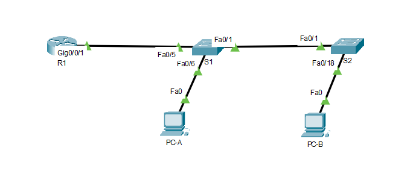

# Оглавление
* [Схема стенда](#scheme)
* [Таблица адресации](#table1)
* [Таблица VLAN](#table2)
* [Часть 1. Создание сети и настройка основных параметров устройства](#part1)
* [Часть 2. Создание сетей VLAN и назначение портов коммутатора](#part2)
* [Часть 3. Настройка транка 802.1Q между коммутаторами](#part3)
* [Часть 4. Настройка маршрутизации между сетями VLAN](#part4)
* [Часть 5. Проверка, что маршрутизация между VLAN работает](#part5)

# <a name="scheme"></a>Схема стенда


# <a name="table1"></a>Таблица адресации

| Устройство    | Интерфейс          | IP-адрес              | Маска подсети  | Шлюз по умолчанию |
| ------------- |:-----------------: | :-------------------: | :------------- | :---------------- |
| R1            | G0/0/1.10          |  192.168.10.1         | 255.255.255.0  | -                 |
|               | G0/0/1.20          |  192.168.20.1         | 255.255.255.0  | -                 |
|               | G0/0/1.30          |  192.168.30.1         | 255.255.255.0  | -                 |
|               | G0/0/1.1000        |  -                    | -              | -                 |
| S1            | VLAN 10            |  192.168.10.11        | 255.255.255.0  | 192.168.10.1      |
| S2            | VLAN 10            |  192.168.10.12        | 255.255.255.0  | 192.168.10.1      |
| PC-A          | NIC                |  192.168.20.3         | 255.255.255.0  | 192.168.20.1      |
| PC-B          | NIC                |  192.168.30.3         | 255.255.255.0  | 192.168.30.1      |

# <a name="table2"></a>Таблица VLAN

| VLAN          | Имя                | Назначенный интерфейс                                         |
| ------------- |: ---------------- :| :------------------------------------------------------------ |
| 10            | Управление         | S1: VLAN 10<br>S2: VLAN 10                                    |
| 20            | Sales              | S1: F0/6                                                      |
| 30            | Operations         | S2: F0/18                                                     |
| 999           | Parking_Lot        | S1: F0/2-4, F0/7-24, G0/1-2<br>S2: F0/2-17, F0/19-24, G0/1-2  |
| 1000          | Собственная        | -                                                             |

# <a name="part1"></a>Часть 1. Создание сети и настройка основных параметров устройства
## Создайте сеть согласно топологии
Готово

## Настройте базовые параметры для маршрутизатора
> * Подключитесь к маршрутизатору с помощью консоли и активируйте привилегированный режим EXEC.
> * Откройте окно конфигурации
> * Войдите в режим конфигурации.
> * Назначьте маршрутизатору имя устройства.
> * Отключите поиск DNS, чтобы предотвратить попытки маршрутизатора неверно преобразовывать введенные команды таким образом, как будто они являются именами узлов.
> * Назначьте class в качестве зашифрованного пароля привилегированного режима EXEC.
> * Назначьте cisco в качестве пароля консоли и включите вход в систему по паролю.
> * Установите cisco в качестве пароля виртуального терминала и активируйте вход.
> * Зашифруйте открытые пароли.
> * Создайте баннер с предупреждением о запрете несанкционированного доступа к устройству.
> * Сохраните текущую конфигурацию в файл загрузочной конфигурации.
> * Настройте на маршрутизаторе время

```shell
Router>enable
Router#configure terminal
Enter configuration commands, one per line.  End with CNTL/Z.
Router(config)#hostname R1
R1(config)#no ip domain-lookup
R1(config)#enable secret class
R1(config)#line console 0
R1(config-line)#password cisco
R1(config-line)#login
R1(config-line)#exit
R1(config)#line vty 0 15
R1(config-line)#password cisco
R1(config-line)#login
R1(config-line)#exit
R1(config)#service password-encryption
R1(config)#banner motd #Authorized Access Only!#
R1(config)#exit
R1#clock set 12:14:00 18 April 2021
R1#copy running-config startup-config 
Destination filename [startup-config]? 
Building configuration...
[OK]
```

## Настройте базовые параметры каждого коммутатора
> * Присвойте коммутатору имя устройства.
> * Отключите поиск DNS, чтобы предотвратить попытки маршрутизатора неверно преобразовывать введенные команды таким образом, как будто они являются именами узлов.
> * Назначьте class в качестве зашифрованного пароля привилегированного режима EXEC.
> * Назначьте cisco в качестве пароля консоли и включите вход в систему по паролю.
> * Установите cisco в качестве пароля виртуального терминала и активируйте вход.
> * Зашифруйте открытые пароли.
> * Создайте баннер с предупреждением о запрете несанкционированного доступа к устройству.
> * Настройте на коммутаторах время.
> * Сохранение текущей конфигурации в качестве начальной.

```shell
Switch>enable
Switch#configure terminal
Switch(config)#hostname S1
S1(config)#no ip domain-lookup
S1(config)#enable secret class
S1(config)#line console 0
S1(config-line)#password cisco
S1(config-line)#login
S1(config-line)#exit
S1(config)#line vty 0 15
S1(config-line)#password cisco
S1(config-line)#login
S1(config-line)#exit
S1(config)#service password-encryption
S1(config)#banner motd #Authorized Access Only!#
S1(config)#exit
S1#clock set 12:19:00 18 April 2021
S1#copy running-config startup-config 
Destination filename [startup-config]? 
Building configuration...
[OK]
```

```shell
Switch>enable
Switch#configure terminal
Switch(config)#hostname S2
S2(config)#no ip domain-lookup
S2(config)#enable secret class
S2(config)#line console 0
S2(config-line)#password cisco
S2(config-line)#login
S2(config-line)#exit
S2(config)#line vty 0 15
S2(config-line)#password cisco
S2(config-line)#login
S2(config-line)#exit
S2(config)#service password-encryption
S2(config)#banner motd #Authorized Access Only!#
S2(config)#exit
S2#clock set 12:23:00 18 April 2021
S2#copy running-config startup-config
Destination filename [startup-config]? 
Building configuration...
[OK]
```

## Настройте узлы ПК
Готово

# <a name="part2"></a>Часть 2. Создание сетей VLAN и назначение портов коммутатора
## Создайте сети VLAN на коммутаторах
> Создайте и назовите необходимые VLAN на каждом коммутаторе из таблицы выше.

```shell
Authorized Access Only!

User Access Verification

Password: 
S1>enable
Password: 
S1#
S1#configure terminal
S1(config)#vlan 10
S1(config-vlan)#name Management
S1(config-vlan)#vlan 20
S1(config-vlan)#name Sales
S1(config-vlan)#vlan 30
S1(config-vlan)#name Operations
S1(config-vlan)#vlan 999
S1(config-vlan)#name Parking_Lot
S1(config-vlan)#vlan 1000
S1(config-vlan)#name Own
```

```shell
Authorized Access Only!

User Access Verification

Password: 

S2>enable
Password: 
S2#configure terminal
S2(config)#vlan 10
S2(config-vlan)#name Management
S2(config-vlan)#vlan 20
S2(config-vlan)#name Sales
S2(config-vlan)#vlan 30
S2(config-vlan)#name Operations
S2(config-vlan)#vlan 999
S2(config-vlan)#name Parking_lot
S2(config-vlan)#vlan 1000
S2(config-vlan)#name Own
```

> Настройте интерфейс управления и шлюз по умолчанию на каждом коммутаторе, используя информацию об IP-адресе в таблице адресации.

```shell
S1(config)#interface Vlan 10
S1(config-if)#ip address 192.168.10.11 255.255.255.0
S1(config-if)#exit
S1(config)#ip default-gateway 192.168.10.1
```

```shell
S2(config)#interface Vlan 10
S2(config-if)#ip address 192.168.10.12 255.255.255.0
S2(config-if)#exit
S2(config)#ip default-gateway 192.168.10.1
```

> Назначьте все неиспользуемые порты коммутатора VLAN Parking_Lot, настройте их для статического режима доступа и административно деактивируйте их.

```shell
S1(config)#interface range f0/2-4
S1(config-if-range)#switchport mode access
S1(config-if-range)#switchport access vlan 999
S1(config-if-range)#shutdown
S1(config-if-range)#interface range f0/7-24
S1(config-if-range)#switchport mode access
S1(config-if-range)#switchport access vlan 999
S1(config-if-range)#shutdown
S1(config-if-range)#interface range g0/1-2
S1(config-if-range)#switchport mode access
S1(config-if-range)#switchport access vlan 999
S1(config-if-range)#shutdown
```

```shell
S2(config)#interface range f0/2-17
S2(config-if-range)#switchport mode access
S2(config-if-range)#switchport access vlan 999
S2(config-if-range)#shutdown
S2(config-if-range)#interface range f0/19-24
S2(config-if-range)#switchport mode access
S2(config-if-range)#switchport access vlan 999
S2(config-if-range)#shutdown
S2(config-if-range)#interface range g0/1-2
S2(config-if-range)#switchport mode access
S2(config-if-range)#switchport access vlan 999
S2(config-if-range)#shutdown
```

## Назначьте сети VLAN соответствующим интерфейсам коммутатора

> Назначьте используемые порты соответствующей VLAN (указанной в таблице VLAN выше) и настройте их для режима статического доступа.

```shell
S1(config)#int f0/6
S1(config-if)#switchport mode access
S1(config-if)#switchport access vlan 20

```

```shell
S2(config)#int f0/18
S2(config-if)#switchport mode access
S2(config-if)#switchport access vlan 30
```

> Убедитесь, что VLAN назначены на правильные интерфейсы.

```shell
S1(config)#do show vlan brief

VLAN Name                             Status    Ports
---- -------------------------------- --------- -------------------------------
1    default                          active    Fa0/1, Fa0/5
10   Management                       active    
20   Sales                            active    Fa0/6
30   Operations                       active    
999  Parking_Lot                      active    Fa0/2, Fa0/3, Fa0/4, Fa0/7
                                                Fa0/8, Fa0/9, Fa0/10, Fa0/11
                                                Fa0/12, Fa0/13, Fa0/14, Fa0/15
                                                Fa0/16, Fa0/17, Fa0/18, Fa0/19
                                                Fa0/20, Fa0/21, Fa0/22, Fa0/23
                                                Fa0/24, Gig0/1, Gig0/2
1000 Own                              active    
1002 fddi-default                     active    
1003 token-ring-default               active    
1004 fddinet-default                  active    
1005 trnet-default                    active    
```

```shell
S2(config-if)#do sh vlan br

VLAN Name                             Status    Ports
---- -------------------------------- --------- -------------------------------
1    default                          active    Fa0/1
10   Management                       active    
20   Sales                            active    
30   Operations                       active    Fa0/18
999  Parking_lot                      active    Fa0/2, Fa0/3, Fa0/4, Fa0/5
                                                Fa0/6, Fa0/7, Fa0/8, Fa0/9
                                                Fa0/10, Fa0/11, Fa0/12, Fa0/13
                                                Fa0/14, Fa0/15, Fa0/16, Fa0/17
                                                Fa0/19, Fa0/20, Fa0/21, Fa0/22
                                                Fa0/23, Fa0/24, Gig0/1, Gig0/2
1000 Own                              active    
1002 fddi-default                     active    
1003 token-ring-default               active    
1004 fddinet-default                  active    
1005 trnet-default                    active
```

# <a name="part3"></a>Часть 3. Настройка транка 802.1Q между коммутаторами

## Вручную настройте магистральный интерфейс F0/1 на коммутаторах S1 и S2

> Настройка статического транкинга на интерфейсе F0/1 для обоих коммутаторов.
> Установите native VLAN 1000 на обоих коммутаторах.

```shell
S1(config)#interface f0/1
S1(config-if)#switchport trunk native vlan 1000
S1(config-if)#switchport mode trunk
```

```shell
S2(config)#interface f0/1
S2(config-if)#switchport trunk native vlan 1000
S2(config-if)#switchport mode trunk
```

> Укажите, что VLAN 10, 20, 30 и 1000 могут проходить по транку.

```shell
S1(config-if)#switchport trunk allowed vlan 10,20,30,1000
```

```shell
S2(config-if)#switchport trunk allowed vlan 10,20,30,1000
```

> Проверьте транки, native VLAN и разрешенные VLAN через транк.

```shell
S1(config-if)#do show vlan brief

VLAN Name                             Status    Ports
---- -------------------------------- --------- -------------------------------
1    default                          active    Fa0/5
10   Management                       active    
20   Sales                            active    Fa0/6
30   Operations                       active    
999  Parking_Lot                      active    Fa0/2, Fa0/3, Fa0/4, Fa0/7
                                                Fa0/8, Fa0/9, Fa0/10, Fa0/11
                                                Fa0/12, Fa0/13, Fa0/14, Fa0/15
                                                Fa0/16, Fa0/17, Fa0/18, Fa0/19
                                                Fa0/20, Fa0/21, Fa0/22, Fa0/23
                                                Fa0/24, Gig0/1, Gig0/2
1000 Own                              active    
1002 fddi-default                     active    
1003 token-ring-default               active    
1004 fddinet-default                  active    
1005 trnet-default                    active

S1(config-if)#do show int trunk
Port        Mode         Encapsulation  Status        Native vlan
Fa0/1       on           802.1q         trunking      1000

Port        Vlans allowed on trunk
Fa0/1       10,20,30,1000

Port        Vlans allowed and active in management domain
Fa0/1       10,20,30,1000

Port        Vlans in spanning tree forwarding state and not pruned
Fa0/1       10,20,30,1000
```

```shell
S2(config-if)#do show vlan brief

VLAN Name                             Status    Ports
---- -------------------------------- --------- -------------------------------
1    default                          active    
10   Management                       active    
20   Sales                            active    
30   Operations                       active    Fa0/18
999  Parking_lot                      active    Fa0/2, Fa0/3, Fa0/4, Fa0/5
                                                Fa0/6, Fa0/7, Fa0/8, Fa0/9
                                                Fa0/10, Fa0/11, Fa0/12, Fa0/13
                                                Fa0/14, Fa0/15, Fa0/16, Fa0/17
                                                Fa0/19, Fa0/20, Fa0/21, Fa0/22
                                                Fa0/23, Fa0/24, Gig0/1, Gig0/2
1000 Own                              active    
1002 fddi-default                     active    
1003 token-ring-default               active    
1004 fddinet-default                  active    
1005 trnet-default                    active

S2(config)#do show int trunk
Port        Mode         Encapsulation  Status        Native vlan
Fa0/1       on           802.1q         trunking      1000

Port        Vlans allowed on trunk
Fa0/1       10,20,30,1000

Port        Vlans allowed and active in management domain
Fa0/1       10,20,30,1000

Port        Vlans in spanning tree forwarding state and not pruned
Fa0/1       10,20,30,1000
```

## Вручную настройте магистральный интерфейс F0/5 на коммутаторе S1
> Настройте интерфейс S1 F0/5 с теми же параметрами транка, что и F0/1. Это транк до маршрутизатора.

```shell
S1(config)#interface f0/5
S1(config-if)#switchport mode trunk
S1(config-if)#switchport trunk native vlan 1000
S1(config-if)#switchport trunk allowed vlan 10,20,30,1000
```

> Сохраните текущую конфигурацию в файл загрузочной конфигурации.

Готово

> Проверка транкинга.
> Вопрос:
> Что произойдет, если G0/0/1 на R1 будет отключен?

Будет невозможно общение между различными VLAN

# <a name="part4"></a>Часть 4. Настройка маршрутизации между сетями VLAN

> При необходимости активируйте интерфейс G0/0/1 на маршрутизаторе.

```shell
R1(config)#interface g0/0/1
R1(config-if)#no shutdown
```

> Настройте подинтерфейсы для каждой VLAN, как указано в таблице IP-адресации. 
> Все подинтерфейсы используют инкапсуляцию 802.1Q. 
> Убедитесь, что подинтерфейсу для native VLAN не назначен IP-адрес. Включите описание для каждого подинтерфейса.

```shell
R1(config)#interface g0/0/1.10
R1(config-subif)#encapsulation dot1Q 10
R1(config-subif)#ip address 192.168.10.1 255.255.255.0
R1(config-subif)#interface g0/0/1.20
R1(config-subif)#encapsulation dot1Q 20
R1(config-subif)#ip address 192.168.20.1 255.255.255.0
R1(config-subif)#interface g0/0/1.30
R1(config-subif)#encapsulation dot1Q 30
R1(config-subif)#ip address 192.168.30.1 255.255.255.0
R1(config-subif)#interface g0/0/1.1000
R1(config-subif)#encapsulation dot1Q 1000
```

> Убедитесь, что вспомогательные интерфейсы работают

```shell
R1#show interface g0/0/1.10
GigabitEthernet0/0/1.10 is up, line protocol is up (connected)
  Hardware is PQUICC_FEC, address is 0001.c983.6a02 (bia 0001.c983.6a02)
  Internet address is 192.168.10.1/24
  MTU 1500 bytes, BW 100000 Kbit, DLY 100 usec, 
     reliability 255/255, txload 1/255, rxload 1/255
  Encapsulation 802.1Q Virtual LAN, Vlan ID 10
  ARP type: ARPA, ARP Timeout 04:00:00, 
  Last clearing of "show interface" counters never

R1#show interface g0/0/1.20
GigabitEthernet0/0/1.20 is up, line protocol is up (connected)
  Hardware is PQUICC_FEC, address is 0001.c983.6a02 (bia 0001.c983.6a02)
  Internet address is 192.168.20.1/24
  MTU 1500 bytes, BW 100000 Kbit, DLY 100 usec, 
     reliability 255/255, txload 1/255, rxload 1/255
  Encapsulation 802.1Q Virtual LAN, Vlan ID 20
  ARP type: ARPA, ARP Timeout 04:00:00, 
  Last clearing of "show interface" counters never

R1#show interface g0/0/1.30
GigabitEthernet0/0/1.30 is up, line protocol is up (connected)
  Hardware is PQUICC_FEC, address is 0001.c983.6a02 (bia 0001.c983.6a02)
  Internet address is 192.168.30.1/24
  MTU 1500 bytes, BW 100000 Kbit, DLY 100 usec, 
     reliability 255/255, txload 1/255, rxload 1/255
  Encapsulation 802.1Q Virtual LAN, Vlan ID 30
  ARP type: ARPA, ARP Timeout 04:00:00, 
  Last clearing of "show interface" counters never

R1#show interface g0/0/1.1000
GigabitEthernet0/0/1.1000 is up, line protocol is up (connected)
  Hardware is PQUICC_FEC, address is 0001.c983.6a02 (bia 0001.c983.6a02)
  MTU 1500 bytes, BW 100000 Kbit, DLY 100 usec, 
     reliability 255/255, txload 1/255, rxload 1/255
  Encapsulation 802.1Q Virtual LAN, Vlan ID 1000
  ARP type: ARPA, ARP Timeout 04:00:00, 
  Last clearing of "show interface" counters never
```

# <a name="part5"></a>Часть 5. Проверка, что маршрутизация между VLAN работает

## Выполните следующие тесты с PC-A. Все должно быть успешно

> Отправьте эхо-запрос с PC-A на шлюз по умолчанию.

```shell
C:\>ping 192.168.20.1

Pinging 192.168.20.1 with 32 bytes of data:

Reply from 192.168.20.1: bytes=32 time<1ms TTL=255
Reply from 192.168.20.1: bytes=32 time<1ms TTL=255
Reply from 192.168.20.1: bytes=32 time<1ms TTL=255
Reply from 192.168.20.1: bytes=32 time<1ms TTL=255

Ping statistics for 192.168.20.1:
    Packets: Sent = 4, Received = 4, Lost = 0 (0% loss),
Approximate round trip times in milli-seconds:
    Minimum = 0ms, Maximum = 0ms, Average = 0ms
```

> Отправьте эхо-запрос с PC-A на PC-B.

```shell
C:\>ping 192.168.30.3

Pinging 192.168.30.3 with 32 bytes of data:

Request timed out.
Reply from 192.168.30.3: bytes=32 time<1ms TTL=127
Reply from 192.168.30.3: bytes=32 time<1ms TTL=127
Reply from 192.168.30.3: bytes=32 time<1ms TTL=127

Ping statistics for 192.168.30.3:
    Packets: Sent = 4, Received = 3, Lost = 1 (25% loss),
Approximate round trip times in milli-seconds:
    Minimum = 0ms, Maximum = 0ms, Average = 0ms
```

> Отправьте команду ping с компьютера PC-A на коммутатор S2.

```shell
C:\>ping 192.168.10.12

Pinging 192.168.10.12 with 32 bytes of data:

Request timed out.
Request timed out.
Reply from 192.168.10.12: bytes=32 time<1ms TTL=254
Reply from 192.168.10.12: bytes=32 time<1ms TTL=254

Ping statistics for 192.168.10.12:
    Packets: Sent = 4, Received = 2, Lost = 2 (50% loss),
Approximate round trip times in milli-seconds:
    Minimum = 0ms, Maximum = 0ms, Average = 0ms
```

## Пройдите следующий тест с PC-B

> В окне командной строки на PC-B выполните команду tracert на адрес PC-A.
> Вопрос:
> Какие промежуточные IP-адреса отображаются в результатах?

Шлюз по умолчанию, так как трафик между различными VLAN идет именно через него.

```shell
C:\>tracert 192.168.20.3

Tracing route to 192.168.20.3 over a maximum of 30 hops: 

  1   0 ms      0 ms      0 ms      192.168.30.1
  2   0 ms      0 ms      0 ms      192.168.20.3

Trace complete.
```