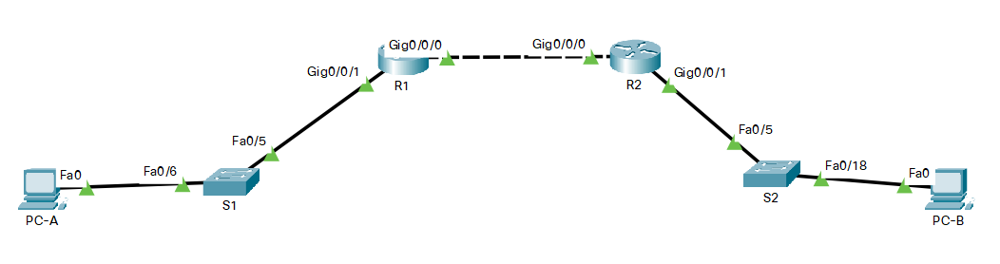

# Оглавление
* [Схема стенда](#scheme)
* [Таблица адресации](#table1)
* [Таблица VLAN](#table2)
* [Часть 1. Создание сети и настройка основных параметров устройства](#part1)
* [Часть 2. Настройка и проверка двух серверов DHCPv4 на R1](#part2)
* [Часть 3. Настройка и проверка DHCP-ретрансляции на R2](#part3)

# <a name="scheme"></a>Схема стенда


# <a name="table1"></a>Таблица адресации
| Устройство    | Интерфейс          | IP-адрес              | Маска подсети    | Шлюз по умолчанию |
| ------------- | :----------------: | :-------------------: | :--------------- | :---------------- |
| R1            | G0/0/0             | 10.0.0.1              | 255.255.255.252  | —                 |
|               | G0/0/1             | —                     | —                |                   |
|               | G0/0/1.100         | 192.168.1.1           | 255.255.255.192  | —                 |
|               | G0/0/1.200         | 192.168.1.65          | 255.255.255.224  | —                 |
|               | G0/0/1.1000        | —                     | —                |                   |
| R2            | G0/0/0             | 10.0.0.2              | 255.255.255.252  | —                 |
|               | G0/0/1             | 192.168.1.97          | 255.255.255.240  | —                 |
| S1            | VLAN 200           |                       |                  |                   |
| S2            | VLAN 1             |                       |                  |                   |
| PC-A          | NIC                | DHCP                  | DHCP             | DHCP              |
| PC-B          | NIC                | DHCP                  | DHCP             | DHCP              |

# <a name="table2"></a>Таблица VLAN
| VLAN          | Имя                | Назначенный интерфейс                    |
| :------------ | :----------------- | :--------------------------------------- |
| 1             | Нет                | S2: F0/18                                |
| 100           | Клиенты            | S1: F0/6                                 |
| 200           | Управление         | S1: VLAN 200                             |
| 999           | Parking_Lot        | S1: F0/1-4, F0/7-24, G0/1-2              |
| 1000          | Собственная        | —                                        |

# <a name="part1"></a>Часть 1. Создание сети и настройка основных параметров устройства
## Создание схемы адресации. Подсеть сети 192.168.1.0/24 в соответствии со следующими требованиями:
### Одна подсеть «Подсеть A», поддерживающая 58 хостов (клиентская VLAN на R1).
> Подсеть A
> * Запишите первый IP-адрес в таблице адресации для R1 G0/0/1.100.
> * Запишите второй IP-адрес в таблице адресов для S1 VLAN 200 и введите соответствующий шлюз по умолчанию.

Для 58 хостов выделим подсеть 192.168.1.0/26.
Следовательно:
* Первый адрес хоста: 192.168.1.2
* Второй адрес хоста: 192.168.1.3
* Шлюз по умолчанию: 192.168.1.1

### Одна подсеть «Подсеть B», поддерживающая 28 хостов (управляющая VLAN на R1).
> Подсеть B
> * Запишите первый IP-адрес в таблице адресации для R1 G0/0/1.200.
> * Запишите второй IP-адрес в таблице адресов для S1 VLAN 1 и введите соответствующий шлюз по умолчанию.
Для 28 хостов выделим подсеть 192.168.1.64/27.
Следовательно:
* Первый адрес хоста: 192.168.1.66
* Второй адрес хоста: 192.168.1.67
* Шлюз по умолчанию: 192.168.1.65

### Одна подсеть «Подсеть C», поддерживающая 12 узлов (клиентская сеть на R2).
> Подсеть C
> * Запишите первый IP-адрес в таблице адресации для R2 G0/0/1.
Для 12 хостов выделим подсеть 192.168.1.96/28.
Следовательно:
* Первый адрес хоста: 192.168.1.98
* Второй адрес хоста: 192.168.1.99
* Шлюз по умолчанию: 192.168.1.97

## Создайте сеть согласно топологии
Выполнено.

## Произведите базовую настройку маршрутизаторов
> Назначьте маршрутизатору имя устройства
> Отключите поиск DNS, чтобы предотвратить попытки маршрутизатора неверно преобразовывать введенные команды таким образом, как будто они являются именами узлов
> Назначьте class в качестве зашифрованного пароля привилегированного режима EXEC
> Назначьте cisco в качестве пароля консоли и включите вход в систему по паролю
> Назначьте cisco в качестве пароля VTY и включите вход в систему по паролю
> Зашифруйте открытые пароли.
> Создайте баннер с предупреждением о запрете несанкционированного доступа к устройству.
> Сохраните текущую конфигурацию в файл загрузочной конфигурации.
> Установите часы на маршрутизаторе на сегодняшнее время и дату.

```shell
Router>enable
Router#configure terminal
Router(config)#hostname R1
R1(config)#no ip domain-lookup
R1(config)#enable password class
R1(config)#line console 0
R1(config-line)#password cisco
R1(config-line)#login
R1(config-line)#exit
R1(config)#line vty 0 15
R1(config-line)#password cisco
R1(config-line)#login
R1(config-line)#exit
R1(config)#service password-encryption
R1(config)#banner motd @Authorized Access Only!@
R1(config)#exit
R1#clock set 11:23:00 25 Oct 2021
R1#copy running-config startup-config 
Destination filename [startup-config]? 
Building configuration...
[OK]
```

```shell
Router>enable
Router#configure terminal
Router(config)#hostname R2
R2(config)#no ip domain-lookup
R2(config)#enable password class
R2(config)#line console 0
R2(config-line)#password cisco
R2(config-line)#login
R2(config-line)#exit
R2(config)#line vty 0 15
R2(config-line)#password cisco
R2(config-line)#login
R2(config-line)#exit
R2(config)#service password-encryption
R2(config)#banner motd @Authorized Access Only!@
R2(config)#exit
R2#clock set 11:27:00 25 Oct 2021
R2#copy running-config startup-config
Destination filename [startup-config]? 
Building configuration...
[OK]
```

## Настройка маршрутизации между сетями VLAN на маршрутизаторе R1
> Активируйте интерфейс G0/0/1 на маршрутизаторе.

```shell
R1(config)#interface g0/0/1
R1(config-if)#no shutdown
```

> Настройте подинтерфейсы для каждой VLAN в соответствии с требованиями таблицы IP-адресации. 
  Все субинтерфейсы используют инкапсуляцию 802.1Q и назначаются первый полезный адрес из вычисленного пула IP-адресов.
  Убедитесь, что подинтерфейсу для native VLAN не назначен IP-адрес. 
  Включите описание для каждого подинтерфейса.

```shell
R1(config)#interface g0/0/1.100
R1(config-subif)#encapsulation dot1Q 100
R1(config-subif)#ip address 192.168.1.1 255.255.255.192
R1(config-subif)#description VLAN100
R1(config-subif)#no shutdown
R1(config-subif)#interface g0/0/1.200
R1(config-subif)#encapsulation dot1Q 200
R1(config-subif)#ip address 192.168.1.65 255.255.255.224
R1(config-subif)#description VLAN200
R1(config-subif)#no shutdown
R1(config-subif)#interface g0/0/1.1000
R1(config-subif)#encapsulation dot1Q 1000 native
R1(config-subif)#description NATIVE
R1(config-subif)#no shutdown
```

> Убедитесь, что вспомогательные интерфейсы работают.

```shell
R1#show ip interface brief
Interface              IP-Address      OK? Method Status                Protocol 
GigabitEthernet0/0/0   unassigned      YES unset  administratively down down 
GigabitEthernet0/0/1   unassigned      YES unset  up                    up 
GigabitEthernet0/0/1.100192.168.1.1     YES manual up                    up 
GigabitEthernet0/0/1.200192.168.1.65    YES manual up                    up 
GigabitEthernet0/0/1.1000unassigned      YES unset  up                    up 
Vlan1                  unassigned      YES unset  administratively down down
```

## Настройте G0/1 на R2, затем G0/0/0 и статическую маршрутизацию для обоих маршрутизаторов
> Настройте G0/0/1 на R2 с первым IP-адресом подсети C, рассчитанным ранее.

```shell
R2(config)#interface g0/0/1
R2(config-if)#ip address 192.168.1.97 255.255.255.240
R2(config-if)#no shutdown
```

> Настройте интерфейс G0/0/0 для каждого маршрутизатора на основе приведенной выше таблицы IP-адресации.

```shell
R1(config)#interface g0/0/0
R1(config-if)#ip address 10.0.0.1 255.255.255.252
R1(config-if)#no shutdown
```

```shell
R2(config)#interface g0/0/0
R2(config-if)#ip address 10.0.0.2 255.255.255.252
R2(config-if)#no shutdown
```

> Настройте маршрут по умолчанию на каждом маршрутизаторе, указываемом на IP-адрес G0/0/0 на другом маршрутизаторе.

```shell
R1(config)#ip route 0.0.0.0 0.0.0.0 10.0.0.2
```

```shell
R2(config)#ip route 0.0.0.0 0.0.0.0 10.0.0.1
```

> Убедитесь, что статическая маршрутизация работает с помощью пинга до адреса G0/0/1 R2 от R1.

```shell
R1#ping 192.168.1.97

Type escape sequence to abort.
Sending 5, 100-byte ICMP Echos to 192.168.1.97, timeout is 2 seconds:
!!!!!
Success rate is 100 percent (5/5), round-trip min/avg/max = 0/0/0 ms
```

> Сохраните текущую конфигурацию в файл загрузочной конфигурации.

Выполнено.

## Настройте базовые параметры каждого коммутатора

```shell
Switch>enable
Switch#configure terminal
Switch(config)#hostname S1
S1(config)#line console 0
S1(config-line)#no ip domain-lookup
S1(config)#enable secret class
S1(config)#line console 0
S1(config-line)#password cisco
S1(config-line)#login
S1(config-line)#exit
S1(config)#line vty 1 15
S1(config-line)#password cisco
S1(config-line)#login
S1(config-line)#exit
S1(config)#service password-encryption
S1(config)#banner motd @Authorized Access Only!@
S1(config)#exit
S1#clock set 12:30:00 25 Oct 2021
S1#copy running-config startup-config 
Destination filename [startup-config]? 
Building configuration...
[OK]
```

```shell
Switch>enable
Switch#configure terminal
Switch(config)#hostname S2
S2(config)#line console 0
S2(config-line)#no ip domain-lookup
S2(config)#enable secret class
S2(config)#line console 0
S2(config-line)#password cisco
S2(config-line)#login
S2(config-line)#exit
S2(config)#line vty 1 15
S2(config-line)#password cisco
S2(config-line)#login
S2(config-line)#exit
S2(config)#service password-encryption
S2(config)#banner motd @Authorized Access Only!@
S2(config)#exit
S2#clock set 12:33:00 25 Oct 2021
S2#copy running-config startup-config
Destination filename [startup-config]? 
Building configuration...
[OK]
```

## Создайте сети VLAN на коммутаторе S1

> Создайте необходимые VLAN на коммутаторе 1 и присвойте им имена из приведенной выше таблицы.

```shell
S1(config)#vlan 100
S1(config-vlan)#name Clients
S1(config-vlan)#vlan 200
S1(config-vlan)#name Management
S1(config-vlan)#vlan 999
S1(config-vlan)#name Parking_Lot 
S1(config-vlan)#vlan 1000
S1(config-vlan)#name Native
```

> Настройте и активируйте интерфейс управления на S1 (VLAN 200), используя второй IP-адрес из подсети, рассчитанный ранее.
  Кроме того установите шлюз по умолчанию на S1.

```shell
S1(config-if)#interface vlan 200
S1(config-if)#ip address 192.168.1.66 255.255.255.224
S1(config-if)#exit
S1(config)#ip default-gateway 192.168.1.65
```

> Настройте и активируйте интерфейс управления на S2 (VLAN 1), используя второй IP-адрес из подсети, рассчитанный ранее. 
  Кроме того, установите шлюз по умолчанию на S2.

```shell
S2(config)#interface vlan 1
S2(config-if)#ip address 192.168.1.98 255.255.255.240
S2(config-if)#exit
S2(config)#ip default-gateway 192.168.1.97
```

> Назначьте все неиспользуемые порты S1 VLAN Parking_Lot, 
  настройте их для статического режима доступа и административно деактивируйте их.
  На S2 административно деактивируйте все неиспользуемые порты.

```shell
S1(config-vlan)#interface range fa0/1-4, fa0/7-24, g0/1-2
S1(config-if-range)#switchport mode access
S1(config-if-range)#switchport access vlan 999
S1(config-if-range)#shutdown
```

```shell
S2(config)#interface range fa0/1-4, fa0/6-17, fa0/19-24, g0/1-2
S2(config-if-range)#shutdown
```

## Назначьте сети VLAN соответствующим интерфейсам коммутатора

> Назначьте используемые порты соответствующей VLAN (указанной в таблице VLAN выше) и настройте их для режима статического доступа.

```shell
S1(config)#interface fa0/6
S1(config-if)#switchport mode access
S1(config-if)#switchport access vlan 100
```

```shell
S2(config)#interface fa0/18
S2(config-if)#switchport mode access
S2(config-if)#switchport access vlan 1
```

> Убедитесь, что VLAN назначены на правильные интерфейсы.

```shell
S1#show vlan brief

VLAN Name                             Status    Ports
---- -------------------------------- --------- -------------------------------
1    default                          active    Fa0/5
100  Clients                          active    Fa0/6
200  Management                       active    
999  Parking_Lot                      active    Fa0/1, Fa0/2, Fa0/3, Fa0/4
                                                Fa0/7, Fa0/8, Fa0/9, Fa0/10
                                                Fa0/11, Fa0/12, Fa0/13, Fa0/14
                                                Fa0/15, Fa0/16, Fa0/17, Fa0/18
                                                Fa0/19, Fa0/20, Fa0/21, Fa0/22
                                                Fa0/23, Fa0/24, Gig0/1, Gig0/2
1000 Native                           active    
1002 fddi-default                     active    
1003 token-ring-default               active    
1004 fddinet-default                  active    
1005 trnet-default                    active
```

```shell
S2#show vlan brief 

VLAN Name                             Status    Ports
---- -------------------------------- --------- -------------------------------
1    default                          active    Fa0/1, Fa0/2, Fa0/3, Fa0/4
                                                Fa0/5, Fa0/6, Fa0/7, Fa0/8
                                                Fa0/9, Fa0/10, Fa0/11, Fa0/12
                                                Fa0/13, Fa0/14, Fa0/15, Fa0/16
                                                Fa0/17, Fa0/18, Fa0/19, Fa0/20
                                                Fa0/21, Fa0/22, Fa0/23, Fa0/24
                                                Gig0/1, Gig0/2
1002 fddi-default                     active    
1003 token-ring-default               active    
1004 fddinet-default                  active    
1005 trnet-default                    active    
```

> Вопрос:
Почему интерфейс F0/5 указан в VLAN 1?

S2 имеет настройки по умолчанию и все порты находятся в VLAN 1.

## Вручную настройте интерфейс S1 F0/5 в качестве транка 802.1Q

> Измените режим порта коммутатора, чтобы принудительно создать магистральный канал.
  В рамках конфигурации транка  установите для native  VLAN значение 1000.
  В качестве другой части конфигурации магистрали укажите, что VLAN 100, 200 и 1000 могут проходить по транку.
  Сохраните текущую конфигурацию в файл загрузочной конфигурации.

```shell
S1(config)#interface fa0/5
S1(config-if)#switchport mode trunk
S1(config-if)#switchport trunk native vlan 1000
S1(config-if)#switchport trunk allowed vlan 100,200,1000
S1(config-if)#end
S1#copy running-config startup-config
Destination filename [startup-config]? 
Building configuration...
[OK]
```

> Проверьте состояние транка.

```shell
S1#show interfaces trunk 
Port        Mode         Encapsulation  Status        Native vlan
Fa0/5       on           802.1q         trunking      1000

Port        Vlans allowed on trunk
Fa0/5       100,200,1000

Port        Vlans allowed and active in management domain
Fa0/5       100,200,1000

Port        Vlans in spanning tree forwarding state and not pruned
Fa0/5       100,200,1000
```

> Какой IP-адрес был бы у ПК, если бы он был подключен к сети с помощью DHCP?

192.168.1.3

# <a name="part2"></a>Часть 2. Настройка и проверка двух серверов DHCPv4 на R1
## Настройте R1 с пулами DHCPv4 для двух поддерживаемых подсетей

> Исключите первые пять используемых адресов из каждого пула адресов.

```shell
R1(config)#ip dhcp excluded-address 192.168.1.1 192.168.1.5
R1(config)#ip dhcp excluded-address 192.168.1.97 192.168.1.101
```

> Откройте окно конфигурации
  Создайте пул DHCP (используйте уникальное имя для каждого пула).
  Укажите сеть, поддерживающую этот DHCP-сервер.
  В качестве имени домена укажите CCNA-lab.com.
  Настройте соответствующий шлюз по умолчанию для каждого пула DHCP.
  Настройте время аренды на 2 дня 12 часов и 30 минут.

```shell
R1(config)#ip dhcp pool R1_Client_LAN
R1(dhcp-config)#network 192.168.1.0 255.255.255.192
R1(dhcp-config)#domain-name CCNA-lab.com
R1(dhcp-config)#default-router 192.168.1.1
```

> Затем настройте второй пул DHCPv4, используя имя пула R2_Client_LAN и вычислите сеть, маршрутизатор по умолчанию, 
 и используйте то же имя домена и время аренды, что и предыдущий пул DHCP.

```shell
R1(config)#ip dhcp pool R2_Client_LAN
R1(dhcp-config)#network 192.168.1.96 255.255.255.240
R1(dhcp-config)#domain-name CCNA-lab.com
R1(dhcp-config)#default-router 192.168.1.97
R1(dhcp-config)#exit
```

## Сохраните конфигурацию

Выполнено.

## Проверка конфигурации сервера DHCPv4

> Чтобы просмотреть сведения о пуле, выполните команду show ip dhcp pool.

```shell
R1#show ip dhcp pool

Pool R1_Client_LAN :
 Utilization mark (high/low)    : 100 / 0
 Subnet size (first/next)       : 0 / 0 
 Total addresses                : 62
 Leased addresses               : 0
 Excluded addresses             : 2
 Pending event                  : none

 1 subnet is currently in the pool
 Current index        IP address range                    Leased/Excluded/Total
 192.168.1.1          192.168.1.1      - 192.168.1.62      0    / 2     / 62

Pool R2_Client_LAN :
 Utilization mark (high/low)    : 100 / 0
 Subnet size (first/next)       : 0 / 0 
 Total addresses                : 14
 Leased addresses               : 0
 Excluded addresses             : 2
 Pending event                  : none

 1 subnet is currently in the pool
 Current index        IP address range                    Leased/Excluded/Total
 192.168.1.97         192.168.1.97     - 192.168.1.110     0    / 2     / 14
```

> Выполните команду show ip dhcp bindings для проверки установленных назначений адресов DHCP.

```shell
R1#show ip dhcp binding 
IP address       Client-ID/              Lease expiration        Type
                 Hardware address
```

> Выполните команду show ip dhcp server statistics для проверки сообщений DHCP

Скорее всего версия образа не та или модель не поддерживает.

## Попытка получить IP-адрес от DHCP на PC-A

> Из командной строки компьютера PC-A выполните команду ipconfig /renew.

```shell
C:\>ipconfig /renew

   IP Address......................: 192.168.1.6
   Subnet Mask.....................: 255.255.255.192
   Default Gateway.................: 192.168.1.1
   DNS Server......................: 0.0.0.0
```

> После завершения процесса обновления выполните команду ipconfig для просмотра новой информации об IP-адресе.

```shell
C:\>ipconfig

FastEthernet0 Connection:(default port)

   Connection-specific DNS Suffix..: CCNA-lab.com
   Link-local IPv6 Address.........: FE80::2D0:97FF:FE5C:D2B2
   IPv6 Address....................: ::
   IPv4 Address....................: 192.168.1.6
   Subnet Mask.....................: 255.255.255.192
   Default Gateway.................: ::
                                     192.168.1.1

Bluetooth Connection:

   Connection-specific DNS Suffix..: CCNA-lab.com
   Link-local IPv6 Address.........: ::
   IPv6 Address....................: ::
   IPv4 Address....................: 0.0.0.0
   Subnet Mask.....................: 0.0.0.0
   Default Gateway.................: ::
                                     0.0.0.0
```

> Проверьте подключение с помощью пинга IP-адреса интерфейса R1 G0/0/1.

```shell
C:\>ping 192.168.1.1

Pinging 192.168.1.1 with 32 bytes of data:

Reply from 192.168.1.1: bytes=32 time<1ms TTL=255
Reply from 192.168.1.1: bytes=32 time<1ms TTL=255
Reply from 192.168.1.1: bytes=32 time=5ms TTL=255
Reply from 192.168.1.1: bytes=32 time<1ms TTL=255

Ping statistics for 192.168.1.1:
    Packets: Sent = 4, Received = 4, Lost = 0 (0% loss),
Approximate round trip times in milli-seconds:
    Minimum = 0ms, Maximum = 5ms, Average = 1ms
```

# <a name="part3"></a>Часть 3. Настройка и проверка DHCP-ретрансляции на R2
## Настройка R2 в качестве агента DHCP-ретрансляции для локальной сети на G0/0/1
## Попытка получить IP-адрес от DHCP на PC-B