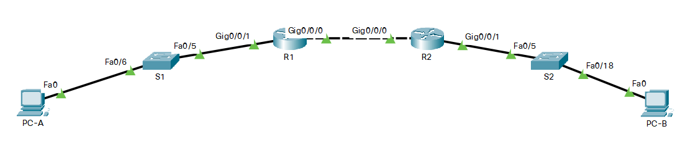

# Оглавление
* [Схема стенда](#scheme)
* [Таблица адресации](#table1)
* [Часть 1. Создание сети и настройка основных параметров устройства](#part1)
* [Часть 2. Проверка назначения адреса SLAAC от R1](#part2)
* [Часть 3. Настройка и проверка состояния DHCPv6 stateless сервера на R1](#part3)
* [Часть 4. Настройка и проверка состояния DHCPv6 сервера на R1](#part4)
* [Часть 5. Настройка и проверка DHCPv6 Relay на R2](#part5)

# <a name="scheme"></a>Схема стенда


# <a name="table1"></a>Таблица адресации
| Устройство    | Интерфейс          | IPv6-адрес             |
| ------------- | :----------------: | :--------------------: |
| R1            | G0/0/0             | 2001:db8:acad:2::1/64  |
|               |                    | fe80::1                |
|               | G0/0/1             | 2001:db8:acad:1::1/64  |
|               |                    | fe80::1                |
| R2            | G0/0/0             | 2001:db8:acad:2::2/64  |
|               |                    | fe80::2                |
|               | G0/0/1             | 2001:db8:acad:3::1/64  |
|               |                    | fe80::1                |
| PC-A          | NIC                | DHCP                   |
| PC-B          | NIC                | DHCP                   |

# <a name="part1"></a>Часть 1. Создание сети и настройка основных параметров устройства
## Создайте сеть согласно топологии
> Подключите устройства, как показано в топологии, и подсоедините необходимые кабели

Выполнено.

## Произведите базовую настройку маршрутизаторов

> Назначьте маршрутизатору имя устройства
> Активация IPv6-маршрутизации

```shell
Router(config)#hostname R1
R1(config)#ipv6 unicast-routing
```

```shell
Router(config)#hostname R2
R2(config)#ipv6 unicast-routing
```

## Настройка интерфейсов и маршрутизации для обоих маршрутизаторов

> Настройте интерфейсы G0/0/0 и G0/1 на R1 и R2 с адресами IPv6, указанными в таблице выше.
  Настройте маршрут по умолчанию на каждом маршрутизаторе, который указывает на IP-адрес G0/0/0 на другом маршрутизаторе.

```shell
R1(config)#interface g0/0/0
R1(config-if)#ipv6 address 2001:db8:acad:2::1/64
R1(config-if)#ipv6 address fe80::1 link-local
R1(config-if)#no shutdown
R1(config-if)#interface g0/0/1
R1(config-if)#ipv6 address 2001:db8:acad:1::1/64
R1(config-if)#ipv6 address fe80::1 link-local
R1(config-if)#no shutdown
R1(config-if)#exit
R1(config)#ipv6 route ::/0 g0/0/0 fe80::2
```

```shell
R2(config)#interface g0/0/0
R2(config-if)#ipv6 address 2001:db8:acad:2::2/64
R2(config-if)#ipv6 address fe80::2 link-local
R2(config-if)#no shutdown
R2(config-if)#interface g0/0/1
R2(config-if)#ipv6 address 2001:db8:acad:3::1/64
R2(config-if)#ipv6 address fe80::1 link-local
R2(config-if)#no shutdown
R2(config-if)#exit
R2(config)#ipv6 route ::/0 g0/0/0 fe80::1
```

> Убедитесь, что маршрутизация работает с помощью пинга адреса G0/0/1 R2 из R1

```shell
R1#ping 2001:db8:acad:3::1

Type escape sequence to abort.
Sending 5, 100-byte ICMP Echos to 2001:db8:acad:3::1, timeout is 2 seconds:
!!!!!
Success rate is 100 percent (5/5), round-trip min/avg/max = 0/0/0 ms
```

# <a name="part2"></a>Часть 2. Проверка назначения адреса SLAAC от R1

> В части 2 вы убедитесь, что узел PC-A получает адрес IPv6 с помощью метода SLAAC.
  Включите PC-A и убедитесь, что сетевой адаптер настроен для автоматической настройки IPv6.
  Через несколько минут результаты команды ipconfig должны показать, что PC-A присвоил себе адрес из сети 2001:db8:1::/64.

```shell
C:\>ipconfig

FastEthernet0 Connection:(default port)

   Connection-specific DNS Suffix..: 
   Link-local IPv6 Address.........: FE80::260:2FFF:FE4A:6A1D
   IPv6 Address....................: 2001:DB8:ACAD:1:260:2FFF:FE4A:6A1D
   Autoconfiguration IPv4 Address..: 169.254.106.29
   Subnet Mask.....................: 255.255.0.0
   Default Gateway.................: FE80::1
                                     0.0.0.0

Bluetooth Connection:

   Connection-specific DNS Suffix..: 
   Link-local IPv6 Address.........: ::
   IPv6 Address....................: ::
   IPv4 Address....................: 0.0.0.0
   Subnet Mask.....................: 0.0.0.0
   Default Gateway.................: ::
                                     0.0.0.0
```

# <a name="part3"></a>Часть 3. Настройка и проверка состояния DHCPv6 stateless сервера на R1
# <a name="part4"></a>Часть 4. Настройка и проверка состояния DHCPv6 сервера на R1
# <a name="part5"></a>Часть 5. Настройка и проверка DHCPv6 Relay на R2
