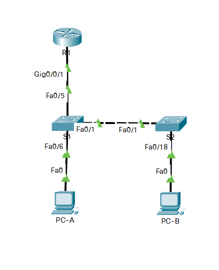

# Оглавление
* [Схема стенда](#scheme)
* [Таблица адресации](#table1)
* [Часть 1. Настройка основного сетевого устройства](#part1)
* [Часть 2. Настройка сетей VLAN](#part2)
* [Часть 3. Настройки безопасности коммутатора](#part3)

# <a name="scheme"></a>Схема стенда


# <a name="table1"></a>Таблица адресации
| Устройство    | Интерфейс/vlan     | IP-адрес              | Маска подсети |
| ------------- | :----------------: | :-------------------: | :------------ |
| R1            | e0/0               | 192.168.10.1          | 255.255.255.0 |
|               | Loopback 0         | 10.10.1.1             | 255.255.255.0 |
| S1            | VLAN 10            | 192.168.10.201        | 255.255.255.0 |
| S2            | VLAN 10            | 192.168.10.202        | 255.255.255.0 |
| PC-A          | NIC                | DHCP                  | 255.255.255.0 |
| PC-B          | NIC                | DHCP                  | 255.255.255.0 |

# <a name="part1"></a>Часть 1. Настройка основного сетевого устройства
## Шаг 1.1. Создайте сеть.

> a. Создайте сеть согласно топологии.
> b. Инициализация устройств

Выполнено.

## Шаг 1.2. Настройте маршрутизатор R1

> 1.1.a. Загрузите следующий конфигурационный скрипт на R1

```shell
Router>enable
Router#configure terminal
Router(config)#hostname R1
R1(config)#no ip domain-lookup
R1(config)#ip dhcp excluded-address 192.168.10.1 192.168.10.9
R1(config)#ip dhcp excluded-address 192.168.10.201 192.168.10.202
R1(config)#ip dhcp pool Students
R1(dhcp-config)#network 192.168.10.0 255.255.255.0
R1(dhcp-config)#default-router 192.168.10.1
R1(dhcp-config)#domain-name ccna2.lab-11.6.1
R1(dhcp-config)#interface loopback 0
R1(config-if)#ip address 10.10.1.1 255.255.255.0
R1(config-if)#interface e0/0
R1(config-if)#description Link to S1
R1(config-if)#ip address 192.168.10.1 255.255.255.0
R1(config-if)#no shutdown
R1(config-if)#line console 0
R1(config-line)#logging synchronous
R1(config-line)#exec-timeout 0 0
```

> 1.1.b. Проверьте текущую конфигурацию на R1, используя следующую команду:
R1# show ip interface brief

```shell
R1#show ip interface brief
Interface                  IP-Address      OK? Method Status                Protocol
Ethernet0/0                192.168.10.1    YES manual up                    up
Ethernet0/1                unassigned      YES unset  administratively down down
Ethernet0/2                unassigned      YES unset  administratively down down
Ethernet0/3                unassigned      YES unset  administratively down down
Loopback0                  10.10.1.1       YES manual up                    up
```

> c. Убедитесь, что IP-адресация и интерфейсы находятся в состоянии up / up (при необходимости устраните неполадки).

Всё работает.

# <a name="part2"></a>Часть 2. Настройка сетей VLAN
## Шаг 2.1. Сконфигруриуйте VLAN 10

> Добавьте VLAN 10 на S1 и S2 и назовите VLAN - Management

```shell
Switch>enable
Switch#configure terminal
Switch(config)#hostname S1
S1(config)#vlan 10
S1(config-vlan)#name Management
```

```shell
Switch>enable
Switch#configure terminal
Switch(config)#hostname S2
S2(config)#vlan 10
S2(config-vlan)#name Management
[OK]
```

## Шаг 2.2. Сконфигруриуйте SVI для VLAN 10

> Настройте IP-адрес в соответствии с таблицей адресации для SVI для VLAN 10 на S1 и S2.
  Включите интерфейсы SVI и предоставьте описание для интерфейса

```shell
S1(config)#interface vlan 10
S1(config-if)#ip address 192.168.10.201 255.255.255.0
S1(config-if)#description SVI
S1(config-if)#no shutdown
```

```shell
S2(config)#interface vlan 10
S2(config-if)#ip address 192.168.10.202 255.255.255.0
S2(config-if)#description SVI
S2(config-if)#no shutdown
```

## Шаг 2.3. Настройте VLAN 333 с именем Native на S1 и S2

```shell
S1(config)#vlan 333
S1(config-vlan)#name Native
```

```shell
S2(config)#vlan 333
S2(config-vlan)#name Native
```

## Шаг 2.4. Настройте VLAN 999 с именем ParkingLot на S1 и S2

```shell
S1(config-vlan)#vlan 999
S1(config-vlan)#name ParkingLot
```

```shell
S2(config-vlan)#vlan 999
S2(config-vlan)#name ParkingLot
```

# <a name="part3"></a>Часть 3. Настройки безопасности коммутатора
## Шаг 3.1. Релизация магистральных соединений 802.1Q

> 3.1.a. Настройте все магистральные порты e0/0 на обоих коммутаторах для использования VLAN 333 в качестве native VLAN

```shell
S1(config)#interface e0/0
S1(config-if)#switchport trunk encapsulation dot1q
S1(config-if)#switchport mode trunk
S1(config-if)#switchport trunk native vlan 333
```

```shell
S2(config-vlan)#interface e0/0
S2(config-if)#switchport trunk encapsulation dot1q
S2(config-if)#switchport mode trunk
S2(config-if)#switchport trunk native vlan 333
```

> 3.1.b. Убедитесь, что режим транкинга успешно настроен на всех коммутаторах.
show interface trunk

```shell
S1#show interface trunk

Port        Mode             Encapsulation  Status        Native vlan
Et0/0       on               802.1q         trunking      333

Port        Vlans allowed on trunk
Et0/0       1-4094

Port        Vlans allowed and active in management domain
Et0/0       1,10,333,999

Port        Vlans in spanning tree forwarding state and not pruned
Et0/0       1,10,333,999
```

```shell
S2#show interface trunk

Port        Mode             Encapsulation  Status        Native vlan
Et0/0       on               802.1q         trunking      333

Port        Vlans allowed on trunk
Et0/0       1-4094

Port        Vlans allowed and active in management domain
Et0/0       1,10,333,999

Port        Vlans in spanning tree forwarding state and not pruned
Et0/0       1,10,333,999
```

> 3.1.c. Отключить согласование DTP e0/0 на S1 и S2
> 3.1.d. Проверьте с помощью команды show interfaces
show interfaces e0/0 switchport | include Negotiation

```shell
S1(config)#interface e0/0
S1(config-if)#switchport nonegotiate
S1#show interfaces e0/0 switchport | include Negotiation
Negotiation of Trunking: Off

```

```shell
S2(config)#interface e0/0
S2(config-if)#switchport nonegotiate
```

## Шаг 3.2. Настройка портов доступа

> 3.2.a. На S1 настройте e0/1 и e0/2 в качестве портов доступа и свяжите их с VLAN 10.

```shell
S1(config)#interface e0/2
S1(config-if)#switchport mode access
S1(config-if)#switchport access vlan 10
S1(config-if)#interface e0/1
S1(config-if)#switchport mode access
S1(config-if)#switchport access vlan 10
```

> 3.2.b. На S2 настройте порт доступа e0/2 и свяжите его с VLAN 10.

```shell
S2(config)#interface e0/2
S2(config-if)#switchport mode access
S2(config-if)#switchport access vlan 10
```

## Шаг 3.3. Безопасность неиспользуемых портов коммутатора

> 3.3.a. На S1 и S2 переместите неиспользуемые порты из VLAN 1 в VLAN 999 и отключите неиспользуемые порты.

```shell
S1(config)#interface e0/3
S1(config-if)#switchport mode access
S1(config-if)#switchport access vlan 999
S1(config-if)#shutdown
```

```shell
S2(config)#interface range e0/1,e0/3
S2(config-if-range)#switchport mode access
S2(config-if-range)#switchport access vlan 999
S2(config-if-range)#shutdown
```

> 3.3.b. Убедитесь, что неиспользуемые порты отключены и связаны с VLAN 999, введя команду  show.
show interfaces status

```shell
S1#show interfaces status

Port      Name               Status       Vlan       Duplex  Speed Type
Et0/0                        connected    trunk        auto   auto unknown
Et0/1                        connected    10           auto   auto unknown
Et0/2                        connected    10           auto   auto unknown
Et0/3                        disabled     999          auto   auto unknown
```

```shell
S2#show interfaces status

Port      Name               Status       Vlan       Duplex  Speed Type
Et0/0                        connected    trunk        auto   auto unknown
Et0/1                        disabled     999          auto   auto unknown
Et0/2                        connected    10           auto   auto unknown
Et0/3                        disabled     999          auto   auto unknown
```

## Шаг 3.4. Документирование и реализация функций безопасности порта

> 3.4.a. На S1, введите команду show port-security interface e0/2
 для отображения настроек по умолчанию безопасности порта для интерфейса e0/2.
  Запишите свои ответы ниже

### Конфигурация безопасности порта по умолчанию:
| Функция                                        | Настройка по умолчанию    |
| :--------------------------------------------- | :------------------------ |
| Защита портов                                  | Disabled                  |
| Максимальное количество записей MAC-адресов    | 1                         |
| Режим проверки на нарушение безопасности       | Shutdown                  |
| Aging Time                                     | 0 mins                    |
| Aging Type                                     | Absolute                  |
| Secure Static Address Aging                    | Disabled                  |
| Sticky MAC Addresses                           | 0                         |

> 3.4.b. На S1 включите защиту порта на e0/2 со следующими настройками:
Максимальное количество записей MAC-адресов: 3
Режим безопасности: restrict
Aging time: 60 мин.
Aging type: неактивный

```shell
S1(config)#interface e0/2
S1(config-if)#switchport port-security
S1(config-if)#switchport port-security maximum 3
S1(config-if)#switchport port-security violation restrict
S1(config-if)#switchport port-security aging time 60
S1(config-if)#switchport port-security aging type inactivity
```

> 3.4.c. Verify port security on S1 e0/2

Заодно перезапустил PC-A.

```shell
S1#show port-security interface e0/2
Port Security              : Enabled
Port Status                : Secure-up
Violation Mode             : Restrict
Aging Time                 : 60 mins
Aging Type                 : Inactivity
SecureStatic Address Aging : Disabled
Maximum MAC Addresses      : 3
Total MAC Addresses        : 1
Configured MAC Addresses   : 0
Sticky MAC Addresses       : 0
Last Source Address:Vlan   : 0050.7966.6804:10
Security Violation Count   : 0
```

```shell
S1#show port-security address
               Secure Mac Address Table
-----------------------------------------------------------------------------
Vlan    Mac Address       Type                          Ports   Remaining Age
                                                                   (mins)
----    -----------       ----                          -----   -------------
  10    0050.7966.6804    SecureDynamic                 Et0/2       60 (I)
-----------------------------------------------------------------------------
Total Addresses in System (excluding one mac per port)     : 0
Max Addresses limit in System (excluding one mac per port) : 4096
```

> 3.4.d. Включите безопасность порта для e0/2 на S2. 
  Настройте каждый активный порт доступа таким образом, чтобы он автоматически добавлял адреса МАС,
 изученные на этом порту, в текущую конфигурацию.

```shell
S2(config)#interface e0/2
S2(config-if)#switchport port-security
S2(config-if)#switchport port-security mac-address sticky
```

> 3.4.e. Настройте следующие параметры безопасности порта на e0/2:
Максимальное количество записей MAC-адресов: 2
Тип безопасности: Protect
Aging time: 60 мин.

```shell
S2(config-if)#switchport port-security maximum 2
S2(config-if)#switchport port-security violation protect
S2(config-if)#switchport port-security aging time 60
```

> 3.4.f. Проверка функции безопасности портов на S2 e0/2.
S2# show port-security interface e0/2

Заодно перезапустил PC-B.

```shell
S2#show port-security interface e0/2
Port Security              : Enabled
Port Status                : Secure-up
Violation Mode             : Protect
Aging Time                 : 60 mins
Aging Type                 : Absolute
SecureStatic Address Aging : Disabled
Maximum MAC Addresses      : 2
Total MAC Addresses        : 1
Configured MAC Addresses   : 0
Sticky MAC Addresses       : 1
Last Source Address:Vlan   : 0050.7966.6805:10
Security Violation Count   : 0
```

## Шаг 3.5. Реализовать безопасность DHCP snooping

3.5.a. На S2 включите DHCP snooping и настройте DHCP snooping во VLAN 10.

```shell
S2(config)#ip dhcp snooping
S2(config)#ip dhcp snooping vlan 10
```

3.5.b. Настройте магистральные порты на S2 как доверенные порты.

```shell
S2(config)#interface e0/0
S2(config-if)#ip dhcp snooping trust
```

3.5.c. Ограничьте ненадежный порт e0/2 на S2 пятью DHCP-пакетами в секунду.

```shell
S2(config-if)#interface e0/2
S2(config-if)#ip dhcp snooping limit rate 5
```

3.5.d. Проверка DHCP Snooping на S2

```shell
S2#show ip dhcp snooping
Switch DHCP snooping is enabled
Switch DHCP gleaning is disabled
DHCP snooping is configured on following VLANs:
10
DHCP snooping is operational on following VLANs:
10
DHCP snooping is configured on the following L3 Interfaces:

Insertion of option 82 is enabled
   circuit-id default format: vlan-mod-port
   remote-id: aabb.cc00.2000 (MAC)
Option 82 on untrusted port is not allowed
Verification of hwaddr field is enabled
Verification of giaddr field is enabled
DHCP snooping trust/rate is configured on the following Interfaces:

Interface                  Trusted    Allow option    Rate limit (pps)
-----------------------    -------    ------------    ----------------
Ethernet0/0                yes        yes             unlimited
  Custom circuit-ids:
Ethernet0/2                no         no              5
  Custom circuit-ids:
```

> 3.5.e. В командной строке на PC-B освободите, а затем обновите IP-адрес

!!!Также, чтобы всё заработало, предварительно необходимо выполнить следующую команду:

```shell
S2(config)#no ip dhcp snooping information option
```

```shell
VPCS> dhcp
DDORA IP 192.168.10.10/24 GW 192.168.10.1
```

> 3.5.f. Проверьте привязку отслеживания DHCP с помощью команды show ip dhcp snooping binding

```shell
S2#show ip dhcp snooping binding
MacAddress          IpAddress        Lease(sec)  Type           VLAN  Interface
------------------  ---------------  ----------  -------------  ----  --------------------
00:50:79:66:68:05   192.168.10.10    86297       dhcp-snooping   10    Ethernet0/2
Total number of bindings: 1
```

## Шаг 3.6. Реализация PortFast и BPDU Guard

> 3.6.a. Настройте PortFast на всех портах доступа, которые используются на обоих коммутаторах

```shell
S1(config)#interface range e0/1-2
S1(config-if-range)#spanning-tree portfast
%Warning: portfast should only be enabled on ports connected to a single
 host. Connecting hubs, concentrators, switches, bridges, etc... to this
 interface  when portfast is enabled, can cause temporary bridging loops.
 Use with CAUTION

%Portfast will be configured in 2 interfaces due to the range command
 but will only have effect when the interfaces are in a non-trunking mode.
```

```shell
S2(config)#interface e0/2
S2(config-if)#spanning-tree portfast
```

> 3.6.b. Включите защиту BPDU на портах доступа VLAN 10 S1 и S2, подключенных к PC-A и PC-B

```shell
S1(config)#interface range e0/1-2
S1(config-if-range)#spanning-tree bpduguard enable
```

```shell
S2(config)#interface e0/2
S2(config-if)#spanning-tree bpduguard enable
```

> 3.6.c. Убедитесь, что защита BPDU и PortFast включены на соответствующих портах.
S1# show spanning-tree interface e0/2 detail

```shell
S1#show spanning-tree interface e0/2 detail
 Port 3 (Ethernet0/2) of VLAN0010 is designated forwarding
   Port path cost 100, Port priority 128, Port Identifier 128.3.
   Designated root has priority 32778, address aabb.cc00.1000
   Designated bridge has priority 32778, address aabb.cc00.1000
   Designated port id is 128.3, designated path cost 0
   Timers: message age 0, forward delay 0, hold 0
   Number of transitions to forwarding state: 1
   The port is in the portfast edge mode
   Link type is shared by default
   Bpdu guard is enabled
   BPDU: sent 990, received 0
```

## Шаг 3.7. Проверьте наличие сквозного подключения

```shell
VPCS> dhcp
DDORA IP 192.168.10.11/24 GW 192.168.10.1

VPCS> ping 192.168.10.10

84 bytes from 192.168.10.10 icmp_seq=1 ttl=64 time=1.164 ms
84 bytes from 192.168.10.10 icmp_seq=2 ttl=64 time=1.272 ms
84 bytes from 192.168.10.10 icmp_seq=3 ttl=64 time=1.062 ms
84 bytes from 192.168.10.10 icmp_seq=4 ttl=64 time=1.173 ms
84 bytes from 192.168.10.10 icmp_seq=5 ttl=64 time=1.229 ms

VPCS>
VPCS> ping 192.168.10.1

84 bytes from 192.168.10.1 icmp_seq=1 ttl=255 time=2.162 ms
84 bytes from 192.168.10.1 icmp_seq=2 ttl=255 time=1.545 ms
^C
VPCS> ping 192.168.10.201

192.168.10.201 icmp_seq=1 timeout
84 bytes from 192.168.10.201 icmp_seq=2 ttl=255 time=1.217 ms
84 bytes from 192.168.10.201 icmp_seq=3 ttl=255 time=0.801 ms
84 bytes from 192.168.10.201 icmp_seq=4 ttl=255 time=0.843 ms
^C
VPCS> ping 192.168.10.202

192.168.10.202 icmp_seq=1 timeout
84 bytes from 192.168.10.202 icmp_seq=2 ttl=255 time=1.852 ms
84 bytes from 192.168.10.202 icmp_seq=3 ttl=255 time=1.509 ms
84 bytes from 192.168.10.202 icmp_seq=4 ttl=255 time=1.451 ms
```

# Вопросы для повторения

> Часть 1. С точки зрения безопасности порта на S2, почему нет значения таймера для оставшегося возраста в минутах, 
 когда было сконфигурировано динамическое обучение - sticky?

Потому что таких адресов эта настройка не учитывается.
Такие адреса хранятся в конфигурации.

> Часть 2. Что касается безопасности порта на S2, если вы загружаете скрипт текущей конфигурации на S2, 
 почему порту e0/2 на PC-B никогда не получит IP-адрес через DHCP?

Не совсем понятен вопрос, но, предположу, что надо было выполнить команду:

```shell
S2(config)#no ip dhcp snooping information option
```

> Часть 3. Что касается безопасности порта, 
 в чем разница между типом абсолютного устаревания и типом устаревание по неактивности?

В первом случае по истечении срока сработает настройка безопасности.
Во втором случае она сработает только если устройство не было активно указанное время.
