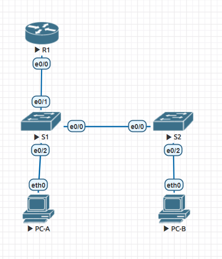

# Оглавление
* [Схема стенда](#scheme)
* [Таблица адресации](#table1)
* [Часть 1. Настройка основного сетевого устройства](#part1)
* [Часть 2. Настройка сетей VLAN](#part2)
* [Часть 3. Настройки безопасности коммутатора](#part3)

# <a name="scheme"></a>Схема стенда


# <a name="table1"></a>Таблица адресации
| Устройство    | Интерфейс/vlan     | IP-адрес              | Маска подсети |
| ------------- | :----------------: | :-------------------: | :------------ |
| R1            | G0/0/1             | 192.168.10.1          | 255.255.255.0 |
|               | Loopback 0         | 10.10.1.1             | 255.255.255.0 |
| S1            | VLAN 10            | 192.168.10.201        | 255.255.255.0 |
| S2            | VLAN 10            | 192.168.10.202        | 255.255.255.0 |
| PC-A          | NIC                | DHCP                  | 255.255.255.0 |
| PC-B          | NIC                | DHCP                  | 255.255.255.0 |

# <a name="part1"></a>Часть 1. Настройка основного сетевого устройства
## Шаг 1.1. Создайте сеть.

> a. Создайте сеть согласно топологии.
> b. Инициализация устройств

Выполнено.

## Шаг 1.2. Настройте маршрутизатор R1

> 1.1.a. Загрузите следующий конфигурационный скрипт на R1

```shell
Router>enable
Router#configure terminal
Router(config)#hostname R1
R1(config)#no ip domain-lookup
R1(config)#ip dhcp excluded-address 192.168.10.1 192.168.10.9
R1(config)#ip dhcp excluded-address 192.168.10.201 192.168.10.202
R1(config)#ip dhcp pool Students
R1(dhcp-config)#network 192.168.10.0 255.255.255.0
R1(dhcp-config)#default-router 192.168.10.1
R1(dhcp-config)#domain-name ccna2.lab-11.6.1
R1(dhcp-config)#interface loopback0
R1(config-if)#ip address 10.10.1.1 255.255.255.0
R1(config)#interface g0/0/1
R1(config-if)#description Link to S1
R1(config-if)#ip address 192.168.10.1 255.255.255.0
R1(config-if)#no shutdown
R1(config-if)#line console 0
R1(config-line)#logging synchronous
R1(config-line)#exec-timeout 0 0
```

> 1.1.b. Проверьте текущую конфигурацию на R1, используя следующую команду:
R1# show ip interface brief

```shell
R1#show ip interface brief
Interface              IP-Address      OK? Method Status                Protocol 
GigabitEthernet0/0/0   unassigned      YES unset  administratively down down 
GigabitEthernet0/0/1   192.168.10.1    YES manual up                    up 
GigabitEthernet0/0/2   unassigned      YES unset  administratively down down 
Loopback0              10.10.1.1       YES manual up                    up 
Vlan1                  unassigned      YES unset  administratively down down
```

> c. Убедитесь, что IP-адресация и интерфейсы находятся в состоянии up / up (при необходимости устраните неполадки).

Всё работает.

# <a name="part2"></a>Часть 2. Настройка сетей VLAN
## Шаг 2.1. Сконфигруриуйте VLAN 10

> Добавьте VLAN 10 на S1 и S2 и назовите VLAN - Management

```shell
Switch>enable
Switch#configure terminal
Switch(config)#hostname S1
S1(config)#vlan 10
S1(config-vlan)#name Management
S1(config-vlan)#^Z
S1#copy running-config startup-config 
Destination filename [startup-config]? 
Building configuration...
[OK]
```

```shell
Switch>enable
Switch#configure terminal
Switch(config)#hostname S2
S2(config)#vlan 10
S2(config-vlan)#name Management
S2(config-vlan)#^Z
S2#copy running-config startup-config 
Destination filename [startup-config]? 
Building configuration...
[OK]
```

## Шаг 2.2. Сконфигруриуйте SVI для VLAN 10

> Настройте IP-адрес в соответствии с таблицей адресации для SVI для VLAN 10 на S1 и S2.
  Включите интерфейсы SVI и предоставьте описание для интерфейса

```shell
S1(config)#interface vlan 10
S1(config-if)#ip address 192.168.10.201 255.255.255.0
S1(config-if)#description SVI
```

```shell
S2(config)#interface vlan 10
S2(config-if)#ip address 192.168.10.202 255.255.255.0
S2(config-if)#description SVI
```

## Шаг 2.3. Настройте VLAN 333 с именем Native на S1 и S2

```shell
S1(config)#vlan 333
S1(config-vlan)#name Native
```

```shell
S2(config)#vlan 333
S2(config-vlan)#name Native
```

## Шаг 2.4. Настройте VLAN 999 с именем ParkingLot на S1 и S2

```shell
S1(config-vlan)#vlan 999
S1(config-vlan)#name ParkingLot
```

```shell
S2(config-vlan)#vlan 999
S2(config-vlan)#name ParkingLot
```

# <a name="part3"></a>Часть 3. Настройки безопасности коммутатора
## Шаг 3.1. Релизация магистральных соединений 802.1Q

> 3.1.a. Настройте все магистральные порты Fa0/1 на обоих коммутаторах для использования VLAN 333 в качестве native VLAN

```shell
S1(config)#interface fa0/1
S1(config-if)#switchport mode trunk
S1(config-if)#switchport trunk native vlan 333
```

```shell
S2(config)#interface fa0/1
S2(config-if)#switchport mode trunk
S2(config-if)#switchport trunk native vlan 333
```

> 3.1.b. Убедитесь, что режим транкинга успешно настроен на всех коммутаторах.
show interface trunk

```shell
S1#show interfaces trunk 
Port        Mode         Encapsulation  Status        Native vlan
Fa0/1       on           802.1q         trunking      333

Port        Vlans allowed on trunk
Fa0/1       1-1005

Port        Vlans allowed and active in management domain
Fa0/1       1,10,333,999

Port        Vlans in spanning tree forwarding state and not pruned
Fa0/1       1,10,333,999
```

```shell
S2#show interfaces trunk 
Port        Mode         Encapsulation  Status        Native vlan
Fa0/1       on           802.1q         trunking      333

Port        Vlans allowed on trunk
Fa0/1       1-1005

Port        Vlans allowed and active in management domain
Fa0/1       1,10,333,999

Port        Vlans in spanning tree forwarding state and not pruned
Fa0/1       1,10,333,999
```

> 3.1.c. Отключить согласование DTP F0/1 на S1 и S2
> 3.1.d. Проверьте с помощью команды show interfaces
show interfaces f0/1 switchport | include Negotiation

```shell
S1(config-if)#switchport nonegotiate
S1#show interfaces fa0/1 switchport | include Negotiation
Negotiation of Trunking: Off
```

```shell
S2(config)#interface fa0/1
S2(config-if)#switchport nonegotiate
```

## Шаг 3.2. Настройка портов доступа

> 3.2.a. На S1 настройте F0/5 и F0/6 в качестве портов доступа и свяжите их с VLAN 10.

Выполнено.

> 3.2.b. На S2 настройте порт доступа Fa0/18 и свяжите его с VLAN 10.

```shell
S1(config)#interface range fa0/5-6
S1(config-if-range)#switchport mode access
S1(config-if-range)#switchport access vlan 10
```

```shell
S2(config)#interface fa0/18
S2(config-if)#switchport mode access
S2(config-if)#switchport access vlan 10
```

## Шаг 3.3. Безопасность неиспользуемых портов коммутатора

> 3.3.a. На S1 и S2 переместите неиспользуемые порты из VLAN 1 в VLAN 999 и отключите неиспользуемые порты.

```shell
S1(config)#interface range fa0/2-4,fa0/7-24,g0/1-2
S1(config-if-range)#switchport mode access
S1(config-if-range)#switchport access vlan 999
S1(config-if-range)#shutdown
```

```shell
S2(config)#interface range fa0/2-17,fa0/19-24,g0/1-2
S2(config-if-range)#switchport mode access
S2(config-if-range)#switchport access vlan 999
S2(config-if-range)#shutdown
```

> 3.3.b. Убедитесь, что неиспользуемые порты отключены и связаны с VLAN 999, введя команду  show.
show interfaces status

```shell
S1#show interfaces status
Port      Name               Status       Vlan       Duplex  Speed Type
Fa0/1                        connected    1          auto    auto  10/100BaseTX
Fa0/2                        disabled 999        auto    auto  10/100BaseTX
Fa0/3                        disabled 999        auto    auto  10/100BaseTX
Fa0/4                        disabled 999        auto    auto  10/100BaseTX
Fa0/5                        connected    10         auto    auto  10/100BaseTX
Fa0/6                        connected    10         auto    auto  10/100BaseTX
Fa0/7                        disabled 999        auto    auto  10/100BaseTX
Fa0/8                        disabled 999        auto    auto  10/100BaseTX
Fa0/9                        disabled 999        auto    auto  10/100BaseTX
Fa0/10                       disabled 999        auto    auto  10/100BaseTX
Fa0/11                       disabled 999        auto    auto  10/100BaseTX
Fa0/12                       disabled 999        auto    auto  10/100BaseTX
Fa0/13                       disabled 999        auto    auto  10/100BaseTX
Fa0/14                       disabled 999        auto    auto  10/100BaseTX
Fa0/15                       disabled 999        auto    auto  10/100BaseTX
Fa0/16                       disabled 999        auto    auto  10/100BaseTX
Fa0/17                       disabled 999        auto    auto  10/100BaseTX
Fa0/18                       disabled 999        auto    auto  10/100BaseTX
Fa0/19                       disabled 999        auto    auto  10/100BaseTX
Fa0/20                       disabled 999        auto    auto  10/100BaseTX
Fa0/21                       disabled 999        auto    auto  10/100BaseTX
Fa0/22                       disabled 999        auto    auto  10/100BaseTX
Fa0/23                       disabled 999        auto    auto  10/100BaseTX
Fa0/24                       disabled 999        auto    auto  10/100BaseTX
Gig0/1                       disabled 999        auto    auto  10/100BaseTX
Gig0/2                       disabled 999        auto    auto  10/100BaseTX
```

```shell
S2#show interfaces status
Port      Name               Status       Vlan       Duplex  Speed Type
Fa0/1                        connected    1          auto    auto  10/100BaseTX
Fa0/2                        disabled 999        auto    auto  10/100BaseTX
Fa0/3                        disabled 999        auto    auto  10/100BaseTX
Fa0/4                        disabled 999        auto    auto  10/100BaseTX
Fa0/5                        disabled 999        auto    auto  10/100BaseTX
Fa0/6                        disabled 999        auto    auto  10/100BaseTX
Fa0/7                        disabled 999        auto    auto  10/100BaseTX
Fa0/8                        disabled 999        auto    auto  10/100BaseTX
Fa0/9                        disabled 999        auto    auto  10/100BaseTX
Fa0/10                       disabled 999        auto    auto  10/100BaseTX
Fa0/11                       disabled 999        auto    auto  10/100BaseTX
Fa0/12                       disabled 999        auto    auto  10/100BaseTX
Fa0/13                       disabled 999        auto    auto  10/100BaseTX
Fa0/14                       disabled 999        auto    auto  10/100BaseTX
Fa0/15                       disabled 999        auto    auto  10/100BaseTX
Fa0/16                       disabled 999        auto    auto  10/100BaseTX
Fa0/17                       disabled 999        auto    auto  10/100BaseTX
Fa0/18                       connected    10         auto    auto  10/100BaseTX
Fa0/19                       disabled 999        auto    auto  10/100BaseTX
Fa0/20                       disabled 999        auto    auto  10/100BaseTX
Fa0/21                       disabled 999        auto    auto  10/100BaseTX
Fa0/22                       disabled 999        auto    auto  10/100BaseTX
Fa0/23                       disabled 999        auto    auto  10/100BaseTX
Fa0/24                       disabled 999        auto    auto  10/100BaseTX
Gig0/1                       disabled 999        auto    auto  10/100BaseTX
Gig0/2                       disabled 999        auto    auto  10/100BaseTX
```

## Шаг 3.4. Документирование и реализация функций безопасности порта

> 3.4.a. На S1, введите команду show port-security interface f0/6 
 для отображения настроек по умолчанию безопасности порта для интерфейса F0/6.
  Запишите свои ответы ниже

### Конфигурация безопасности порта по умолчанию:
| Функция                                        | Настройка по умолчанию    |
| :--------------------------------------------- | :------------------------ |
| Защита портов                                  | Disabled                  |
| Максимальное количество записей MAC-адресов    | 1                         |
| Режим проверки на нарушение безопасности       | Shutdown                  |
| Aging Time                                     | 0 mins                    |
| Aging Type                                     | Absolute                  |
| Secure Static Address Aging                    | Disabled                  |
| Sticky MAC Address                             | 0                         |

> 3.4.b. На S1 включите защиту порта на F0 / 6 со следующими настройками:
Максимальное количество записей MAC-адресов: 3
Режим безопасности: restrict
Aging time: 60 мин.
Aging type: неактивный

К сожалению, не удалось поменять aging type - не нашел в packet tracer этой настройки.
Проверил в Termilab - там работает.

```shell
S1(config)#interface fa0/6
S1(config-if)#switchport port-security
S1(config-if)#switchport port-security maximum 3
S1(config-if)#switchport port-security violation restrict 
S1(config-if)#switchport port-security aging time 60
```

> 3.4.c. Verify port security on S1 F0/6

```shell

S1#show port-security interface fa0/6
Port Security              : Enabled
Port Status                : Secure-up
Violation Mode             : Restrict
Aging Time                 : 60 mins
Aging Type                 : Absolute
SecureStatic Address Aging : Disabled
Maximum MAC Addresses      : 3
Total MAC Addresses        : 0
Configured MAC Addresses   : 0
Sticky MAC Addresses       : 0
Last Source Address:Vlan   : 0000.0000.0000:0
Security Violation Count   : 0
```

```shell
S1#show port-security address
			Secure Mac Address Table
-------------------------------------------------------------------------------
Vlan	Mac Address	Type			Ports		Remaining Age
								(mins)
----	-----------	----			-----		-------------
------------------------------------------------------------------------------
Total Addresses in System (excluding one mac per port)     : 0
Max Addresses limit in System (excluding one mac per port) : 102
```

По какой-то причине в packet tracer не отображается эта информация.
В Termilab - работает.

> 3.4.d. Включите безопасность порта для F0 / 18 на S2. 
  Настройте каждый активный порт доступа таким образом, чтобы он автоматически добавлял адреса МАС,
 изученные на этом порту, в текущую конфигурацию.

```shell
S2(config)#interface fa0/18
S2(config-if)#switchport port-security 
S2(config-if)#switchport port-security mac-address sticky
```

> 3.4.e. Настройте следующие параметры безопасности порта на S2 F / 18:
Максимальное количество записей MAC-адресов: 2
Тип безопасности: Protect
Aging time: 60 мин.

```shell
S2(config-if)#switchport port-security maximum 2
S2(config-if)#switchport port-security violation protect 
S2(config-if)#switchport port-security aging time 60
```

> 3.4.f. Проверка функции безопасности портов на S2 F0/18.
S2# show port-security interface f0/18

```shell
S2#show port-security interface fa0/18
Port Security              : Enabled
Port Status                : Secure-up
Violation Mode             : Protect
Aging Time                 : 60 mins
Aging Type                 : Absolute
SecureStatic Address Aging : Disabled
Maximum MAC Addresses      : 2
Total MAC Addresses        : 0
Configured MAC Addresses   : 0
Sticky MAC Addresses       : 0
Last Source Address:Vlan   : 0000.0000.0000:0
Security Violation Count   : 0
```

## Шаг 3.5. Реализовать безопасность DHCP snooping

3.5.a. На S2 включите DHCP snooping и настройте DHCP snooping во VLAN 10.

```shell
S2(config)#ip dhcp snooping
S2(config)#ip dhcp snooping vlan 10
```

3.5.b. Настройте магистральные порты на S2 как доверенные порты.

```shell
S2(config)#interface fa0/1
S2(config-if)#ip dhcp snooping trust
```

3.5.c. Ограничьте ненадежный порт Fa0/18 на S2 пятью DHCP-пакетами в секунду.

```shell
S2(config-if)#interface fa0/18
S2(config-if)#ip dhcp snooping limit rate 3
```

3.5.d. Проверка DHCP Snooping на S2

```shell
S2#show ip dhcp snooping
Switch DHCP snooping is enabled
DHCP snooping is configured on following VLANs:
10
Insertion of option 82 is enabled
Option 82 on untrusted port is not allowed
Verification of hwaddr field is enabled
Interface                  Trusted    Rate limit (pps)
-----------------------    -------    ----------------
FastEthernet0/1            yes        unlimited       
FastEthernet0/18           no         3
```

> 3.5.e. В командной строке на PC-B освободите, а затем обновите IP-адрес

```shell

```