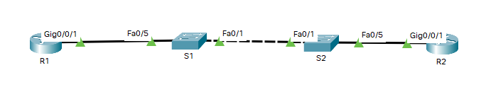

# Оглавление
* [Схема стенда](#scheme)
* [Таблица адресации](#table1)
* [Часть 1. Создание сети и настройка основных параметров устройства](#part1)
* [Часть 2. Настройка и проверка базовой работы протокола  OSPFv2 для одной области](#part2)
* [Часть 3. Оптимизация и проверка конфигурации OSPFv2 для одной области](#part3)

# <a name="scheme"></a>Схема стенда


# <a name="table1"></a>Таблица адресации
| Устройство    | Интерфейс/vlan     | IP-адрес              | Маска подсети |
| ------------- | :----------------: | :-------------------: | :------------ |
| R1            | G0/0/1             | 10.53.0.1             | 255.255.255.0 |
|               | Loopback1          | 172.16.1.1            | 255.255.255.0 |
| R2            | G0/0/1             | 10.53.0.2             | 255.255.255.0 |
|               | Loopback1          | 192.168.1.1           | 255.255.255.0 |

# <a name="part1"></a>Часть 1. Создание сети и настройка основных параметров устройства
## Шаг 1.1. Создайте сеть согласно топологии

Выполнено.

## Шаг 1.2. Произведите базовую настройку маршрутизаторов

Выполнено.

## Шаг 1.3. Настройте базовые параметры каждого коммутатора

Выполнено.

# <a name="part2"></a>Часть 2. Настройка и проверка базовой работы протокола  OSPFv2 для одной области
## Шаг 2.1. Настройте адреса интерфейса и базового OSPFv2 на каждом маршрутизаторе
> 2.1.a. Настройте адреса интерфейсов на каждом маршрутизаторе, как показано в таблице адресации выше.

```shell
R1(config)#interface G0/0/1
R1(config-if)#ip address 10.53.0.1 255.255.255.0
R1(config-if)#no shutdown
R1(config-if)#interface loopback1
R1(config-if)#ip address 172.16.1.1 255.255.255.0
R1(config-if)#no shutdown
```

```shell
R2(config)#interface G0/0/1
R2(config-if)#ip address 10.53.0.2 255.255.255.0
R2(config-if)#no shutdown
R2(config-if)#interface loopback1
R2(config-if)#ip address 192.168.1.1 255.255.255.
R2(config-if)#no shutdown
```

> 2.1.b. Перейдите в режим конфигурации маршрутизатора OSPF, используя идентификатор процесса 56.
> 2.1.c. Настройте статический идентификатор маршрутизатора для каждого маршрутизатора (1.1.1.1 для R1, 2.2.2.2 для R2).
> 2.1.d. Настройте инструкцию сети для сети между R1 и R2, поместив ее в область 0.

```shell
R1(config)#router ospf 56
R1(config-router)#router-id 1.1.1.1
R1(config-router)#network 10.53.0.0 0.0.255.255 area 0
```

```shell
R2(config)#router ospf 56
R2(config-router)#router-id 2.2.2.2
R2(config-router)#network 10.53.0.0 0.0.255.255 area 0
```

> 2.1.e. Только на R2 добавьте конфигурацию, необходимую для объявления сети Loopback 1 в область OSPF 0.

```shell
R2(config-router)#network 192.168.1.0 0.0.0.255 area 0
```

> 2.1.f. Убедитесь, что OSPFv2 работает между маршрутизаторами. Выполните команду, чтобы убедиться, что R1 и R2 сформировали смежность.
Вопрос:
Какой маршрутизатор является DR? Какой маршрутизатор является BDR? Каковы критерии отбора?

Роль DR выполняет R2 так как у него выше router-id (priority у всех 1), и, соответственно, роль BDR у R1.

```shell
R1#show ip ospf neighbor 


Neighbor ID     Pri   State           Dead Time   Address         Interface
2.2.2.2           1   FULL/BDR        00:00:35    10.53.0.2       GigabitEthernet0/0/1
```

```shell
R2#show ip ospf neighbor 


Neighbor ID     Pri   State           Dead Time   Address         Interface
1.1.1.1           1   FULL/DR         00:00:39    10.53.0.1       GigabitEthernet0/0/1
```

> 1.1.a. На R1 выполните команду show ip route ospf, чтобы убедиться, что сеть R2 Loopback1 присутствует в таблице маршрутизации. 
  Обратите внимание, что поведение OSPF по умолчанию заключается в объявлении интерфейса обратной связи 
 в качестве маршрута узла с использованием 32-битной маски.

```shell
R1#show ip route ospf
     192.168.1.0/32 is subnetted, 1 subnets
O       192.168.1.1 [110/2] via 10.53.0.2, 00:05:32, GigabitEthernet0/0/1
```

> 1.1.b. Запустите Ping до  адреса интерфейса R2 Loopback 1 из R1. Выполнение команды ping должно быть успешным

```shell
R1#ping 192.168.1.1

Type escape sequence to abort.
Sending 5, 100-byte ICMP Echos to 192.168.1.1, timeout is 2 seconds:
!!!!!
Success rate is 100 percent (5/5), round-trip min/avg/max = 0/0/1 ms
```

# <a name="part3"></a>Часть 3. Оптимизация и проверка конфигурации OSPFv2 для одной области
