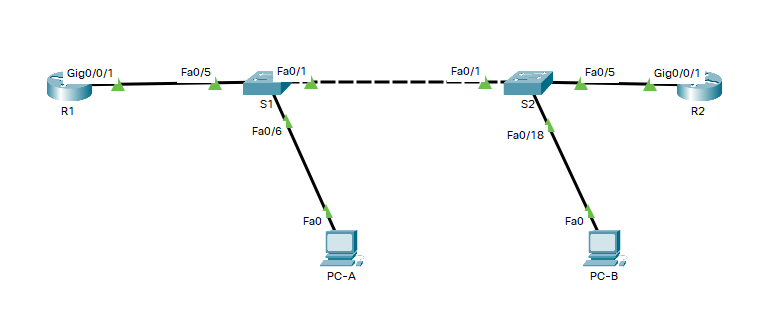

# Оглавление
* [Схема стенда](#scheme)
* [Таблица адресации](#table1)
* [Таблица VLAN](#table2)
* [Часть 1. Создание сети и настройка основных параметров устройства](#part1)
* [Часть 2. Настройка и проверка списков расширенного контроля доступа](#part2)
* [Часть 3. Настройте транки (магистральные каналы)](#part3)
* [Часть 4. Настройте маршрутизацию](#part4)
* [Часть 5. Настройте удаленный доступ](#part5)
* [Часть 6. Проверка подключения](#part6)
* [Часть 7. Настройка и проверка списков контроля доступа (ACL)](#part7)

# <a name="scheme"></a>Схема стенда


# <a name="table1"></a>Таблица адресации
| Устройство    | Интерфейс          | IP-адрес              | Маска подсети | Шлюз по умолчанию |
| ------------- | :----------------: | :-------------------: | :------------ | :---------------- |
| R1            | G0/0/1             | —                     | —             | —                 |
|               | G0/0/1.20          | 10.20.0.1             | 255.255.255.0 |                   |
|               | G0/0/1.30          | 10.30.0.1             | 255.255.255.0 |                   |
|               | G0/0/1.40          | 10.40.0.1             | 255.255.255.0 |                   |
|               | G0/0/1.1000        | —                     | —             |                   |
|               | Loopback1          | 172.16.1.1            | 255.255.255.0 |                   |
| R2            | G0/0/1             | 10.20.0.4             | 255.255.255.0 | —                 |
| S1            | VLAN 20            | 10.20.0.2             | 255.255.255.0 | 10.20.0.1         |
| S2            | VLAN 20            | 10.20.0.3             | 255.255.255.0 | 10.20.0.1         |
| PC-A          | NIC                | 10.30.0.10            | 255.255.255.0 | 10.30.0.1         |
| PC-B          | NIC                | 10.40.0.10            | 255.255.255.0 | 10.40.0.1         |

# <a name="table2"></a>Таблица VLAN
| VLAN          | Имя                | Назначенный интерфейс                                                 |
| ------------- | :----------------: | :-------------------------------------------------------------------: |
| 20            | Management         | S2: F0/5                                                              |
| 30            | Operations         | S1: F0/6                                                              |
| 40            | Sales              | S2: F0/18                                                             |
| 999           | ParkingLot         | S1: F0/2-4, F0/7-24, G0/1-2     S2: F0/2-4, F0/6-17, F0/19-24, G0/1-2 |
| 1000          | Native             | —                                                                     |

# <a name="part1"></a>Часть 1. Создание сети и настройка основных параметров устройства
## Шаг 1.1. Создайте сеть согласно топологии.

Выполнено.

## Шаг 1.2. Произведите базовую настройку маршрутизаторов.

Выполнено.

## Шаг 1.3. Настройте базовые параметры каждого коммутатора.

Выполнено.

# <a name="part2"></a>Часть 2. Настройка сетей VLAN на коммутаторах
# Шаг 2.1. Создайте сети VLAN на коммутаторах

> 2.1.a. Создайте необходимые VLAN и назовите их на каждом коммутаторе из приведенной выше таблицы.

```shell
S1(config)#vlan 20
S1(config-vlan)#name Management
S1(config-vlan)#vlan 30
S1(config-vlan)#name Operations
S1(config-vlan)#vlan 40
S1(config-vlan)#name Sales
S1(config-vlan)#vlan 999
S1(config-vlan)#name ParkingLot
S1(config-vlan)#vlan 1000
S1(config-vlan)#name Native
```

```shell
S2(config)#vlan 20
S2(config-vlan)#name Management
S2(config-vlan)#vlan 30
S2(config-vlan)#name Operations
S2(config-vlan)#vlan 40
S2(config-vlan)#name Sales
S2(config-vlan)#vlan 999
S2(config-vlan)#name ParkingLot
S2(config-vlan)#vlan 1000
S2(config-vlan)#name Native
```

> 2.1.b. Настройте интерфейс управления и шлюз по умолчанию на каждом коммутаторе, используя информацию об IP-адресе в таблице адресации.

```shell
S1(config)#int vlan 20
S1(config-if)#ip address 10.20.0.2 255.255.255.0
S1(config-if)#no shutdown
S1(config-if)#exit
S1(config)#ip default-gateway 10.20.0.1
```

```shell
S2(config)#int vlan 20
S2(config-if)#ip address 10.20.0.3 255.255.255.0
S2(config-if)#no shutdown
S2(config-if)#exit
S2(config)#ip default-gateway 10.20.0.
```

> 2.1.c. Назначьте все неиспользуемые порты коммутатора VLAN Parking Lot,
 настройте их для статического режима доступа и административно деактивируйте их.

```shell
S1(config)#interface range f0/2-4, f0/7-24, g0/1-2
S1(config-if-range)#switchport mode access
S1(config-if-range)#switchport access vlan 999
S1(config-if-range)#shutdown
```

```shell
S2(config)#interface range f0/2-4, f0/6-17, g0/1-2
S2(config-if-range)#switchport mode access
S2(config-if-range)#switchport access vlan 999
S2(config-if-range)#shutdown
```

## Шаг 2.2. Назначьте сети VLAN соответствующим интерфейсам коммутатора.

> 2.2.a. Назначьте используемые порты соответствующей VLAN (указанной в таблице VLAN выше) и настройте их для режима статического доступа.

```shell
S1(config)#interface f0/6
S1(config-if)#switchport mode access
S1(config-if)#switchport access vlan 30
```

```shell
S2(config)#interface fa0/5
S2(config-if)#switchport mode access
S2(config-if)#switchport access vlan 20
S2(config-if)#interface fa0/18
S2(config-if)#switchport mode access
S2(config-if)#switchport access vlan 40
```

> 2.2.b. Выполните команду show vlan brief, чтобы убедиться, что сети VLAN назначены правильным интерфейсам.

```shell
S1#show vlan brief 

VLAN Name                             Status    Ports
---- -------------------------------- --------- -------------------------------
1    default                          active    Fa0/1, Fa0/5
20   Management                       active    
30   Operations                       active    Fa0/6
40   Sales                            active    
999  ParkingLot                       active    Fa0/2, Fa0/3, Fa0/4, Fa0/7
                                                Fa0/8, Fa0/9, Fa0/10, Fa0/11
                                                Fa0/12, Fa0/13, Fa0/14, Fa0/15
                                                Fa0/16, Fa0/17, Fa0/18, Fa0/19
                                                Fa0/20, Fa0/21, Fa0/22, Fa0/23
                                                Fa0/24, Gig0/1, Gig0/2
1000 Native                           active    
1002 fddi-default                     active    
1003 token-ring-default               active    
1004 fddinet-default                  active    
1005 trnet-default                    active
```

```shell
S2#show vlan brief 

VLAN Name                             Status    Ports
---- -------------------------------- --------- -------------------------------
1    default                          active    Fa0/1, Fa0/19, Fa0/20, Fa0/21
                                                Fa0/22, Fa0/23, Fa0/24
20   Management                       active    Fa0/5
30   Operations                       active    
40   Sales                            active    Fa0/18
999  ParkingLot                       active    Fa0/2, Fa0/3, Fa0/4, Fa0/6
                                                Fa0/7, Fa0/8, Fa0/9, Fa0/10
                                                Fa0/11, Fa0/12, Fa0/13, Fa0/14
                                                Fa0/15, Fa0/16, Fa0/17, Gig0/1
                                                Gig0/2
1000 Native                           active    
1002 fddi-default                     active    
1003 token-ring-default               active    
1004 fddinet-default                  active    
1005 trnet-default                    active
```

# <a name="part3"></a>Часть 3. Настройте транки (магистральные каналы)

## Шаг 3.1. Вручную настройте магистральный интерфейс F0/1

> 3.1.a. Измените режим порта коммутатора на интерфейсе F0/1, чтобы принудительно создать магистральную связь. 
  Не забудьте сделать это на обоих коммутаторах.

```shell
S1(config)#interface fa0/1
S1(config-if)#switchport mode trunk
```

```shell
S2(config)#interface fa0/1
S2(config-if)#switchport mode trunk
```

> 3.1.b. В рамках конфигурации транка установите для native vlan значение 1000 на обоих коммутаторах. 
  При настройке двух интерфейсов для разных собственных VLAN сообщения об ошибках могут отображаться временно.

```shell
S1(config-if)#switchport trunk native vlan 1000
```

```shell
S2(config-if)#switchport trunk native vlan 1000
```

> 3.1.c. В качестве другой части конфигурации транка укажите, что VLAN 10, 20, 30 и 1000 разрешены в транке.

```shell
S1(config-if)#switchport trunk allowed vlan 10,20,30,1000
```

```shell
S2(config-if)#switchport trunk allowed vlan 10,20,30,1000
```

> 3.1.d. Выполните команду show interfaces trunk для проверки портов магистрали, собственной VLAN и разрешенных VLAN через магистраль.

```shell
S1#show interfaces trunk 
Port        Mode         Encapsulation  Status        Native vlan
Fa0/1       on           802.1q         trunking      1000

Port        Vlans allowed on trunk
Fa0/1       10,20,30,1000

Port        Vlans allowed and active in management domain
Fa0/1       20,30,1000

Port        Vlans in spanning tree forwarding state and not pruned
Fa0/1       20,30,1000
```

```shell
S2#show interfaces trunk 
Port        Mode         Encapsulation  Status        Native vlan
Fa0/1       on           802.1q         trunking      1000

Port        Vlans allowed on trunk
Fa0/1       10,20,30,1000

Port        Vlans allowed and active in management domain
Fa0/1       20,30,1000

Port        Vlans in spanning tree forwarding state and not pruned
Fa0/1       20,30,1000
```

## Шаг 3.2. Вручную настройте магистральный интерфейс F0/5 на коммутаторе S1

> 3.2.a. Настройте интерфейс S1 F0/5 с теми же параметрами транка, что и F0/1. Это транк до маршрутизатора.

```shell
S1(config)#interface fa0/5
S1(config-if)#switchport mode trunk 
S1(config-if)#switchport trunk native vlan 1000
S1(config-if)#switchport trunk allowed vlan 10,20,30,1000
```

> 3.2.b. Сохраните текущую конфигурацию в файл загрузочной конфигурации.

Выполнено.

> 3.2.c. Используйте команду show interfaces trunk для проверки настроек транка.

Заодно включил интерфейсы маршрутизаторов.

```shell
S1#show interfaces trunk 
Port        Mode         Encapsulation  Status        Native vlan
Fa0/1       on           802.1q         trunking      1000
Fa0/5       on           802.1q         trunking      1000

Port        Vlans allowed on trunk
Fa0/1       10,20,30,1000
Fa0/5       10,20,30,1000

Port        Vlans allowed and active in management domain
Fa0/1       20,30,1000
Fa0/5       20,30,1000

Port        Vlans in spanning tree forwarding state and not pruned
Fa0/1       20,30,1000
Fa0/5       20,30,1000
```

# <a name="part4"></a>Часть 4. Настройте маршрутизацию

## Шаг 4.1. Настройка маршрутизации между сетями VLAN на R1

> 4.1.a. Активируйте интерфейс G0/0/1 на маршрутизаторе.

Выполнено ранее.

> 4.1.b. Настройте подинтерфейсы для каждой VLAN, как указано в таблице IP-адресации.
  Все подинтерфейсы используют инкапсуляцию 802.1Q. 
  Убедитесь, что подинтерфейс для собственной VLAN не имеет назначенного IP-адреса. Включите описание для каждого подинтерфейса.

```shell
R1(config)#interface g0/0/1.20
R1(config-subif)#encapsulation dot1Q 20
R1(config-subif)#ip address 10.20.0.1 255.255.255.0
R1(config-subif)#description VLAN 20
R1(config-subif)#no shutdown

R1(config-subif)#interface g0/0/1.30
R1(config-subif)#encapsulation dot1Q 30
R1(config-subif)#ip address 10.30.0.1 255.255.255.0
R1(config-subif)#description VLAN 30
R1(config-subif)#no shutdown

R1(config-subif)#interface g0/0/1.40
R1(config-subif)#encapsulation dot1Q 40
R1(config-subif)#ip address 10.40.0.1 255.255.255.0
R1(config-subif)#description VLAN 40
R1(config-subif)#no shutdown

R1(config-subif)#interface g0/0/1.1000
R1(config-subif)#encapsulation dot1Q 1000 native 
R1(config-subif)#description VLAN NATIVE
R1(config-subif)#no shutdown
```

> 4.1.c. Настройте интерфейс Loopback 1 на R1 с адресацией из приведенной выше таблицы.

```shell
R1(config)#interface lo1
R1(config-if)#ip address 172.16.1.1 255.255.255.0
R1(config-if)#no shutdown
```

> 4.1.d. С помощью команды show ip interface brief проверьте конфигурацию подынтерфейса.

```shell
R1#show ip interface brief 
Interface              IP-Address      OK? Method Status                Protocol 
GigabitEthernet0/0/0   unassigned      YES unset  administratively down down 
GigabitEthernet0/0/1   unassigned      YES unset  up                    up 
GigabitEthernet0/0/1.2010.20.0.1       YES manual up                    up 
GigabitEthernet0/0/1.3010.30.0.1       YES manual up                    up 
GigabitEthernet0/0/1.4010.40.0.1       YES manual up                    up 
GigabitEthernet0/0/1.1000unassigned      YES unset  up                    up 
GigabitEthernet0/0/2   unassigned      YES unset  administratively down down 
Loopback1              172.16.1.1      YES manual up                    up 
Vlan1                  unassigned      YES unset  administratively down down
```

## Шаг 4.2. Настройка интерфейса R2 g0/0/1 с использованием адреса из таблицы и маршрута по умолчанию с адресом следующего перехода 10.20.0.1

```shell
R2(config)#interface g0/0/1
R2(config-if)#ip address 10.20.0.4 255.255.255.0
R2(config-if)#no shutdown
R2(config-if)#exit
R2(config)#ip route 0.0.0.0 0.0.0.0 10.20.0.1
```

# <a name="part5"></a>Часть 5. Настройте удаленный доступ

# <a name="part6"></a>Часть 6. Проверка подключения

# <a name="part7"></a>Часть 7. Настройка и проверка списков контроля доступа (ACL)
