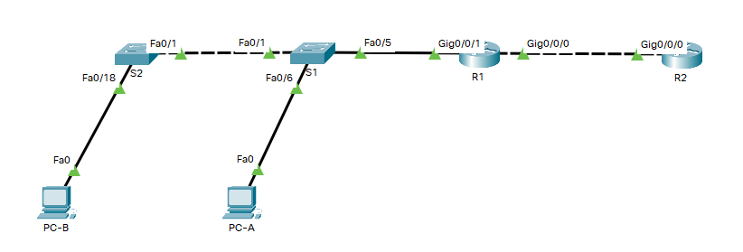

# Оглавление
* [Схема стенда](#scheme)
* [Таблица адресации](#table1)
* [Часть 1. Создание сети и настройка основных параметров устройства](#part1)
* [Часть 2. Настройка и проверка NAT для IPv4](#part2)
* [Часть 3. Настройка и проверка PAT для IPv4](#part3)
* [Часть 4. Настройка и проверка статического NAT для IPv4](#part4)

# <a name="scheme"></a>Схема стенда


# <a name="table1"></a>Таблица адресации
| Устройство    | Интерфейс          | IP-адрес              | Маска подсети   |
| ------------- | :----------------: | :-------------------: | :-------------- |
| R1            | G0/0/0             | 209.165.200.230       | 255.255.255.248 |
|               | G0/0/1             | 192.168.1.1           | 255.255.255.0   |
| R2            | G0/0/0             | 209.165.200.225       | 255.255.255.248 |
|               | Lo1                | 209.165.200.1         | 255.255.255.224 |
| S1            | VLAN 1             | 192.168.1.11          | 255.255.255.0   |
| S2            | VLAN 1             | 192.168.1.12          | 255.255.255.0   |
| PC-A          | NIC                | 192.168.1.2           | 255.255.255.0   |
| PC-B          | NIC                | 192.168.1.3           | 255.255.255.0   |

# <a name="part1"></a>Часть 1. Создание сети и настройка основных параметров устройства
## Шаг 1.1. Создайте сеть согласно топологии.

Выполнено.

## Шаг 1.2. Произведите базовую настройку маршрутизаторов.

Выполнено.

## Шаг 1.3. Настройте базовые параметры каждого коммутатора.

Выполнено.

# <a name="part2"></a>Часть 2. Настройка и проверка NAT для IPv4
## Шаг 2.1. Настройте NAT на R1, используя пул из трех адресов 209.165.200.226-209.165.200.228

```shell
R1(config)#access-list 1 permit 192.168.1.0 0.0.0.255
R1(config)#ip nat pool PUBLIC_ACCESS 209.165.200.226 209.165.200.228 netmask 255.255.255.248
R1(config)#ip nat inside source list 1 pool PUBLIC_ACCESS
R1(config)#interface g0/0/1
R1(config-if)#ip nat inside
R1(config-if)#interface g0/0/0
R1(config-if)#ip nat outside
```

## Шаг 2.2. Проверьте конфигурацию

> 2.2.a. С PC-B,  запустите эхо-запрос интерфейса Lo1 (209.165.200.1) на R2. 
  Если эхо-запрос не прошел, выполните процес поиска и устранения неполадок. 
  На R1 отобразите таблицу NAT на R1 с помощью команды show ip nat translations

```shell
R1#show ip nat translations 
Pro  Inside global     Inside local       Outside local      Outside global
icmp 209.165.200.226:67192.168.1.3:67     209.165.200.1:67   209.165.200.1:67
icmp 209.165.200.226:68192.168.1.3:68     209.165.200.1:68   209.165.200.1:68
icmp 209.165.200.226:69192.168.1.3:69     209.165.200.1:69   209.165.200.1:69
icmp 209.165.200.226:70192.168.1.3:70     209.165.200.1:70   209.165.200.1:70
```

> Во что был транслирован внутренний локальный адрес PC-B?

в 209.165.200.226

> Какой тип адреса NAT является переведенным адресом?

Inside global

> 1.1.a. С PC-A, запустите  эхо-запрос интерфейса Lo1 (209.165.200.1) на R2. 
  Если эхо-запрос не прошел, выполните отладку. 
  На R1 отобразите таблицу NAT на R1 с помощью команды show ip nat translations.

```shell
R1#show ip nat translations 
Pro  Inside global     Inside local       Outside local      Outside global
icmp 209.165.200.226:67192.168.1.3:67     209.165.200.1:67   209.165.200.1:67
icmp 209.165.200.226:68192.168.1.3:68     209.165.200.1:68   209.165.200.1:68
icmp 209.165.200.226:69192.168.1.3:69     209.165.200.1:69   209.165.200.1:69
icmp 209.165.200.226:70192.168.1.3:70     209.165.200.1:70   209.165.200.1:70
icmp 209.165.200.227:21192.168.1.2:21     209.165.200.1:21   209.165.200.1:21
icmp 209.165.200.227:22192.168.1.2:22     209.165.200.1:22   209.165.200.1:22
icmp 209.165.200.227:23192.168.1.2:23     209.165.200.1:23   209.165.200.1:23
icmp 209.165.200.227:24192.168.1.2:24     209.165.200.1:24   209.165.200.1:24
```

> 1.1.b. Обратите внимание, что предыдущая трансляция для PC-B все еще находится в таблице.
  Из S1, эхо-запрос интерфейса Lo1 (209.165.200.1) на R2. 
  Если эхо-запрос не прошел, выполните отладку. 
  На R1 отобразите таблицу NAT на R1 с помощью команды show ip nat translations.

```shell
R1#show ip nat translations 
Pro  Inside global     Inside local       Outside local      Outside global
icmp 209.165.200.226:67192.168.1.3:67     209.165.200.1:67   209.165.200.1:67
icmp 209.165.200.226:68192.168.1.3:68     209.165.200.1:68   209.165.200.1:68
icmp 209.165.200.226:69192.168.1.3:69     209.165.200.1:69   209.165.200.1:69
icmp 209.165.200.226:70192.168.1.3:70     209.165.200.1:70   209.165.200.1:70
icmp 209.165.200.227:21192.168.1.2:21     209.165.200.1:21   209.165.200.1:21
icmp 209.165.200.227:22192.168.1.2:22     209.165.200.1:22   209.165.200.1:22
icmp 209.165.200.227:23192.168.1.2:23     209.165.200.1:23   209.165.200.1:23
icmp 209.165.200.227:24192.168.1.2:24     209.165.200.1:24   209.165.200.1:24
icmp 209.165.200.228:16192.168.1.11:16    209.165.200.1:16   209.165.200.1:16
icmp 209.165.200.228:17192.168.1.11:17    209.165.200.1:17   209.165.200.1:17
icmp 209.165.200.228:18192.168.1.11:18    209.165.200.1:18   209.165.200.1:18
icmp 209.165.200.228:19192.168.1.11:19    209.165.200.1:19   209.165.200.1:19
icmp 209.165.200.228:20192.168.1.11:20    209.165.200.1:20   209.165.200.1:20
```

> 1.1.c. Теперь запускаем пинг R2 Lo1 из S2. 
  На этот раз перевод завершается неудачей, и вы получаете эти сообщения (или аналогичные) на консоли R1

Сообщений таких не вижу (вероятно Packet Tracer их не отображает), но пинг не проходит, т.е. адреса закончились.

```shell
S2#ping 209.165.200.1

Type escape sequence to abort.
Sending 5, 100-byte ICMP Echos to 209.165.200.1, timeout is 2 seconds:
.....
Success rate is 0 percent (0/5
```

> 1.1.d. Это ожидаемый результат, потому что выделено только 3 адреса, и мы попытались ping Lo1 с четырех устройств.
  Напомним, что NAT — это трансляция «один-в-один». 
  Как много выделено трансляций? 
  Введите команду show ip nat translations verbose , и вы увидите, что ответ будет 24 часа

Packet Tracer не поддерживает `show ip nat translations` verbose.

> 1.1.e. Учитывая, что пул ограничен тремя адресами, NAT для пула адресов недостаточно для нашего приложения.
  Очистите преобразование NAT и статистику, и мы перейдем к PAT

Выполнено. А команду `clear ip nat statistics` Packet Tracer не поддерживает.

# <a name="part3"></a>Часть 3. Настройка и проверка PAT для IPv4
## Шаг 2.1. Удалите команду преобразования на R1

Выполнено.

## Шаг 2.2. Добавьте команду PAT на R1

Выполнено.

## Шаг 2.3. Протестируйте и проверьте конфигурацию

> 2.3.a. Давайте проверим, что PAT работает. 
  С PC-B,  запустите эхо-запрос интерфейса Lo1 (209.165.200.1) на R2.
  Если эхо-запрос не прошел, выполните отладку.
  На R1 отобразите таблицу NAT на R1 с помощью команды show ip nat translations

```shell
R1#show ip nat translations 
Pro  Inside global     Inside local       Outside local      Outside global
icmp 209.165.200.228:71192.168.1.3:71     209.165.200.1:71   209.165.200.1:71
icmp 209.165.200.228:72192.168.1.3:72     209.165.200.1:72   209.165.200.1:72
icmp 209.165.200.228:73192.168.1.3:73     209.165.200.1:73   209.165.200.1:73
icmp 209.165.200.228:74192.168.1.3:74     209.165.200.1:74   209.165.200.1:74
```

> Во что был транслирован внутренний локальный адрес PC-B?

209.165.200.228

> Какой тип адреса NAT является переведенным адресом?

Inside global

> Чем отличаются выходные данные команды show ip nat translations из упражнения NAT?

Только inside global адресом - по какой-то причине используется последний адрес из пула.

> 1.1.a. С PC-A, запустите эхо-запрос интерфейса Lo1 (209.165.200.1) на R2. 
  Если эхо-запрос не прошел, выполните отладку.
  На R1 отобразите таблицу NAT на R1 с помощью команды show ip nat translations

```shell
R1#show ip nat translations 
Pro  Inside global     Inside local       Outside local      Outside global
icmp 209.165.200.228:25192.168.1.2:25     209.165.200.1:25   209.165.200.1:25
icmp 209.165.200.228:26192.168.1.2:26     209.165.200.1:26   209.165.200.1:26
icmp 209.165.200.228:27192.168.1.2:27     209.165.200.1:27   209.165.200.1:27
icmp 209.165.200.228:28192.168.1.2:28     209.165.200.1:28   209.165.200.1:28
icmp 209.165.200.228:79192.168.1.3:79     209.165.200.1:79   209.165.200.1:79
icmp 209.165.200.228:80192.168.1.3:80     209.165.200.1:80   209.165.200.1:80
icmp 209.165.200.228:81192.168.1.3:81     209.165.200.1:81   209.165.200.1:81
icmp 209.165.200.228:82192.168.1.3:82     209.165.200.1:82   209.165.200.1:82
```

> 1.1.b. Генерирует трафик с нескольких устройств для наблюдения PAT.
  На PC-A и PC-B используйте параметр -t с командой ping, чтобы отправить безостановочный ping на интерфейс Lo1 R2 (ping -t 209.165.200.1), 
 затем вернитесь к R1 и выполните команду show ip nat translations

```shell
R1#show ip nat translations 
Pro  Inside global     Inside local       Outside local      Outside global
icmp 209.165.200.228:100192.168.1.3:100    209.165.200.1:100  209.165.200.1:100
icmp 209.165.200.228:29192.168.1.2:29     209.165.200.1:29   209.165.200.1:29
icmp 209.165.200.228:30192.168.1.2:30     209.165.200.1:30   209.165.200.1:30
icmp 209.165.200.228:31192.168.1.2:31     209.165.200.1:31   209.165.200.1:31
icmp 209.165.200.228:32192.168.1.2:32     209.165.200.1:32   209.165.200.1:32
icmp 209.165.200.228:33192.168.1.2:33     209.165.200.1:33   209.165.200.1:33
icmp 209.165.200.228:34192.168.1.2:34     209.165.200.1:34   209.165.200.1:34
icmp 209.165.200.228:35192.168.1.2:35     209.165.200.1:35   209.165.200.1:35
icmp 209.165.200.228:36192.168.1.2:36     209.165.200.1:36   209.165.200.1:36
icmp 209.165.200.228:37192.168.1.2:37     209.165.200.1:37   209.165.200.1:37
icmp 209.165.200.228:83192.168.1.3:83     209.165.200.1:83   209.165.200.1:83
icmp 209.165.200.228:84192.168.1.3:84     209.165.200.1:84   209.165.200.1:84
icmp 209.165.200.228:85192.168.1.3:85     209.165.200.1:85   209.165.200.1:85
icmp 209.165.200.228:86192.168.1.3:86     209.165.200.1:86   209.165.200.1:86
icmp 209.165.200.228:87192.168.1.3:87     209.165.200.1:87   209.165.200.1:87
icmp 209.165.200.228:88192.168.1.3:88     209.165.200.1:88   209.165.200.1:88
icmp 209.165.200.228:89192.168.1.3:89     209.165.200.1:89   209.165.200.1:89
icmp 209.165.200.228:90192.168.1.3:90     209.165.200.1:90   209.165.200.1:90
icmp 209.165.200.228:91192.168.1.3:91     209.165.200.1:91   209.165.200.1:91
icmp 209.165.200.228:92192.168.1.3:92     209.165.200.1:92   209.165.200.1:92
icmp 209.165.200.228:93192.168.1.3:93     209.165.200.1:93   209.165.200.1:93
icmp 209.165.200.228:94192.168.1.3:94     209.165.200.1:94   209.165.200.1:94
icmp 209.165.200.228:95192.168.1.3:95     209.165.200.1:95   209.165.200.1:95
icmp 209.165.200.228:96192.168.1.3:96     209.165.200.1:96   209.165.200.1:96
icmp 209.165.200.228:97192.168.1.3:97     209.165.200.1:97   209.165.200.1:97
icmp 209.165.200.228:98192.168.1.3:98     209.165.200.1:98   209.165.200.1:98
icmp 209.165.200.228:99192.168.1.3:99     209.165.200.1:99   209.165.200.1:99
```

> Как маршрутизатор отслеживает, куда идут ответы?

Используя ICMP query id.

> 1.1.a. PAT в пул является очень эффективным решением для малых и средних организаций.
  Тем не менее есть неиспользуемые адреса IPv4, задействованные в этом сценарии.
  Мы перейдем к PAT с перегрузкой интерфейса, чтобы устранить эту трату IPv4 адресов.
  Остановите ping на PC-A и PC-B с помощью комбинации клавиш Control-C, затем очистите трансляции и статистику

Выполнено.

## Шаг 1.2. На R1 удалите команды преобразования nat pool

Выполнено.

## Шаг 1.3. Добавьте команду PAT overload, указав внешний интерфейс

Выполнено.

## Шаг 1.4. Протестируйте и проверьте конфигурацию

> 1.4.a. Давайте проверим PAT, чтобы интерфейс работал. С PC-B,  запустите эхо-запрос интерфейса Lo1 (209.165.200.1) на R2.
  Если эхо-запрос не прошел, выполните отладку.
  На R1 отобразите таблицу NAT на R1 с помощью команды show ip nat translations

```shell
R1#show ip nat translations 
Pro  Inside global     Inside local       Outside local      Outside global
icmp 209.165.200.230:219192.168.1.3:219    209.165.200.1:219  209.165.200.1:219
icmp 209.165.200.230:220192.168.1.3:220    209.165.200.1:220  209.165.200.1:220
icmp 209.165.200.230:221192.168.1.3:221    209.165.200.1:221  209.165.200.1:221
icmp 209.165.200.230:222192.168.1.3:222    209.165.200.1:222  209.165.200.1:222
```

> 1.4.b. Сделайте трафик с нескольких устройств для наблюдения PAT.
  На PC-A и PC-B используйте параметр -t с командой ping для отправки безостановочного ping на интерфейс Lo1 R2 (ping -t 209.165.200.1).
  На S1 и S2 выполните привилегированную команду exec ping 209.165.200.1 повторить 2000. 
  Затем вернитесь к R1 и выполните команду show ip nat translations

```shell
icmp 209.165.200.230:1040192.168.1.12:1357  209.165.200.1:1357 209.165.200.1:1040
icmp 209.165.200.230:1050192.168.1.12:1365  209.165.200.1:1365 209.165.200.1:1050
icmp 209.165.200.230:1059192.168.1.11:1127  209.165.200.1:1127 209.165.200.1:1059
icmp 209.165.200.230:1069192.168.1.11:1137  209.165.200.1:1137 209.165.200.1:1069
icmp 209.165.200.230:1078192.168.1.11:1148  209.165.200.1:1148 209.165.200.1:1078
icmp 209.165.200.230:1143192.168.1.11:1143  209.165.200.1:1143 209.165.200.1:1143
icmp 209.165.200.230:1144192.168.1.11:1144  209.165.200.1:1144 209.165.200.1:1144
icmp 209.165.200.230:1145192.168.1.11:1145  209.165.200.1:1145 209.165.200.1:1145
icmp 209.165.200.230:1146192.168.1.11:1146  209.165.200.1:1146 209.165.200.1:1146
icmp 209.165.200.230:1147192.168.1.11:1147  209.165.200.1:1147 209.165.200.1:1147
icmp 209.165.200.230:1148192.168.1.3:396    209.165.200.1:396  209.165.200.1:1148
```

# <a name="part4"></a>Часть 4. Настройка и проверка статического NAT для IPv4
