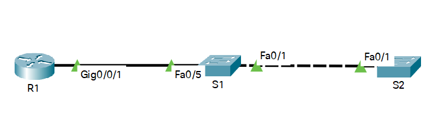

# Оглавление
* [Схема стенда](#scheme)
* [Таблица адресации](#table1)
* [Часть 1. Создание сети и настройка основных параметров устройства](#part1)
* [Часть 2. Обнаружение сетевых ресурсов с помощью протокола CDP](#part2)
* [Часть 3. Обнаружение сетевых ресурсов с помощью протокола LLDP](#part3)
* [Часть 4. Настройка и проверка NTP](#part4)

# <a name="scheme"></a>Схема стенда


# <a name="table1"></a>Таблица адресации
| Устройство    | Интерфейс          | IP-адрес        | Маска подсети   | Шлюз по умолчанию |
| ------------- | :----------------: | :-------------: | :-------------- | :---------------- |
| R1            | Loopback1          | 172.16.1.1      | 255.255.255.0   | —                 |
|               | G0/0/1             | 10.22.0.1       | 255.255.255.0   |                   |
| S1            | SVI VLAN 1         | 10.22.0.2       | 255.255.255.0   | 10.22.0.1         |
| S2            | SVI VLAN 1         | 10.22.0.3       | 255.255.255.0   | 10.22.0.1         |

# <a name="part1"></a>Часть 1. Создание сети и настройка основных параметров устройства
## Шаг 1.1. Создайте сеть согласно топологии.

Выполнено.

## Шаг 1.2. Произведите базовую настройку маршрутизаторов.

Выполнено.

## Шаг 1.3. Настройте базовые параметры каждого коммутатора.

Выполнено.

# <a name="part2"></a>Часть 2. Обнаружение сетевых ресурсов с помощью протокола CDP
> 2.1.a. На R1 используйте соответствующую команду show cdp, чтобы определить, 
 сколько интерфейсов включено CDP, сколько из них включено и сколько отключено.

```shell
R1#show cdp           
Global CDP information:
Sending CDP packets every 60 seconds
Sending a holdtime value of 180 seconds
Sending CDPv2 advertisements is  enabled
R1#show cdp neighbors 
Capability Codes: R - Router, T - Trans Bridge, B - Source Route Bridge
                  S - Switch, H - Host, I - IGMP, r - Repeater, P - Phone, 
                  D - Remote, C - CVTA, M - Two-port Mac Relay 
Device ID        Local Intrfce     Holdtme    Capability  Platform  Port ID
S1               Gig 0/0/1         177              S I   WS-C2960+ Fas 0/5
Total cdp entries displayed : 1
```

> Вопрос: Сколько интерфейсов участвует в объявлениях CDP? Какие из них активны?

Предположу, что нужно выполнять команду `show cdp neighbors`.
Единственный интерфейс g0/0/1 участвует в объявлениях и он активен.

> 1.1.a. На R1 используйте соответствующую команду show cdp, чтобы определить версию IOS, используемую на S1.

```shell
R1#show cdp entry S1
-------------------------
Device ID: S1
Entry address(es): 
Platform: cisco WS-C2960+24TC-L,  Capabilities: Switch IGMP 
Interface: GigabitEthernet0/0/1,  Port ID (outgoing port): FastEthernet0/5
Holdtime : 143 sec
Version :
Cisco IOS Software, C2960 Software (C2960-LANBASEK9-M), Version 15.2(2)E9, RELEASE SOFTWARE (fc4)
Technical Support: http://www.cisco.com/techsupport
Copyright (c) 1986-2018 by Cisco Systems, Inc.
Compiled Sat 08-Sep-18 16:34 by prod_rel_team
advertisement version: 2
Protocol Hello:  OUI=0x00000C, Protocol ID=0x0112; payload len=27, value=00000000FFFFFFFF010221FF000000000000C0255C318C80FF0000
VTP Management Domain: 'SWITCH'
Native VLAN: 1
Duplex: full
```

> Какая версия IOS используется на  S1?

Version 15.2(2)E9

> 1.1.a. На S1 используйте соответствующую команду show cdp, чтобы определить, сколько пакетов CDP было выданных

```shell
S1#show cdp traffic 
CDP counters :
Total packets output: 102, Input: 30
Hdr syntax: 0, Chksum error: 0, Encaps failed: 0
No memory: 0, Invalid packet: 0, 
CDP version 1 advertisements output: 0, Input: 0
CDP version 2 advertisements output: 102, Input: 30
```

> Сколько пакетов имеет выход CDP с момента последнего сброса счетчика?

102

> 1.1.a. Настройте SVI для VLAN 1 на S1 и S2, используя IP-адреса, указанные в таблице адресации выше.
  Настройте шлюз по умолчанию для каждого коммутатора на основе таблицы адресов

```shell
S1(config)#interface vlan1
S1(config-if)#ip address 10.22.0.2 255.255.255.0
S1(config-if)#no shutdown
S1(config-if)#exit
S1(config)#ip default-gateway 10.22.0.1
```

```shell
S2(config)#interface vlan1
S2(config-if)#ip address 10.22.0.3 255.255.255.0
S2(config-if)#no shutdown
S2(config-if)#exit
S2(config)#ip default-gateway 10.22.0.1
```

> 1.1.b. На R1 выполните команду show cdp entry S1 .

```shell
R1#show cdp entry S1
-------------------------
Device ID: S1
Entry address(es): 
  IP address: 10.22.0.2
Platform: cisco WS-C2960+24TC-L,  Capabilities: Switch IGMP 
Interface: GigabitEthernet0/0/1,  Port ID (outgoing port): FastEthernet0/5
Holdtime : 138 sec
Version :
Cisco IOS Software, C2960 Software (C2960-LANBASEK9-M), Version 15.2(2)E9, RELEASE SOFTWARE (fc4)
Technical Support: http://www.cisco.com/techsupport
Copyright (c) 1986-2018 by Cisco Systems, Inc.
Compiled Sat 08-Sep-18 16:34 by prod_rel_team
advertisement version: 2
Protocol Hello:  OUI=0x00000C, Protocol ID=0x0112; payload len=27, value=00000000FFFFFFFF010221FF000000000000C0255C318C80FF0000
VTP Management Domain: 'SWITCH'
Native VLAN: 1
Duplex: full
Management address(es): 
  IP address: 10.22.0.2
```

> Вопрос: Какие дополнительные сведения доступны теперь?

В Entry address(es) и Management address(es) добавился адрес 10.22.0.2

> 1.1.a. Отключить CDP глобально на всех устройствах.

Выполнено.

# <a name="part3"></a>Часть 3. Обнаружение сетевых ресурсов с помощью протокола LLDP

# <a name="part4"></a>Часть 4. Настройка и проверка NTP
